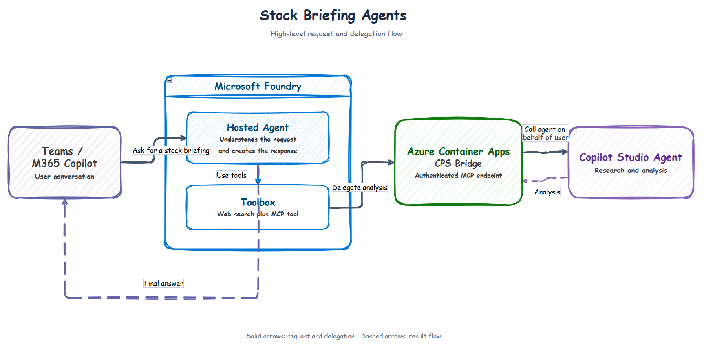
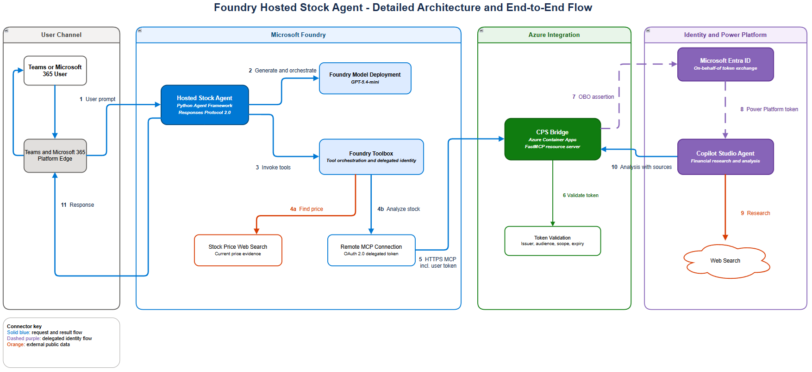

# 📈 Foundry Hosted Stock Agent with Copilot Studio OBO

This sample implements an attended, delegated multi-agent flow across Teams, Microsoft 365 Copilot, a Foundry Hosted Agent, and a Copilot Studio Agent.

## 💡 Use case

A user asks the agent in Teams or Microsoft 365 Copilot for a current market
briefing on Microsoft (`MSFT`). The Foundry Hosted Agent coordinates two
complementary capabilities: Foundry Web Search retrieves the latest available
market price, while a Copilot Studio agent performs broader financial research.
An authenticated MCP bridge connects the two agent platforms and preserves the
signed-in user's delegated identity through the Microsoft Entra on-behalf-of
(OBO) flow.

The end-to-end sequence is:

1. **🔎 Find the current price:** Foundry Web Search finds the latest available
   `MSFT` price together with its currency, market state, timestamp, and source.
2. **🎫 Obtain delegated access:** Foundry obtains a delegated user token for
   the CPS Bridge through the Toolbox connection.
3. **✅ Validate the caller:** The bridge validates the token's signature,
   issuer, audience, expiry, tenant, and required delegated scope.
4. **🔐 Exchange the token:** The bridge performs the Microsoft Entra OBO flow
   to obtain a Power Platform token representing the same signed-in user.
5. **📊 Research the market context:** The bridge calls the Copilot Studio
   agent, which researches current company information, price drivers, material
   news, upcoming catalysts, risks, and supporting sources.
6. **📝 Return the briefing:** The Hosted Agent combines the price snapshot and
   Copilot Studio analysis into a concise, sourced report and returns it to the
   user in Teams or Microsoft 365 Copilot.

## 🏗️ High-level architecture

<p align="center">
  
</p>

<p align="center">
  <em>Teams and Microsoft 365 Copilot connect to a Foundry Hosted Agent, which
  delegates specialist analysis to Copilot Studio through an authenticated CPS
  Bridge on Azure Container Apps.</em>
</p>

For the complete component and identity flow, see the
[Detailed Architecture](#detailed-architecture) section.

The Hosted Agent never receives or stores the raw Teams token. Foundry performs
managed user identity passthrough at the Toolbox connection. The bridge validates
the token issued for its API and exchanges it on behalf of the user for the
Power Platform audience before constructing `CopilotClient`.

## 🧩 Components

| Path | Purpose |
| --- | --- |
| `hosted-agent/` | Python Agent Framework application using Responses protocol 2.0 |
| `cps-bridge/` | Authenticated MCP resource server and Copilot Studio client |
| `copilot-studio/INSTRUCTIONS.txt` | Suggested instructions for the CPS analyst |
| `azure.yaml` | Foundry project, Web Search toolbox, OBO connection, and Hosted Agent |

## ✅ Prerequisites

- A Microsoft Foundry project in a Hosted Agents region.
- Azure Developer CLI 1.27.1 or newer with the `microsoft.foundry` extension.
- Permission to create Foundry agents, toolboxes, connections, and an Azure Bot
  resource when publishing to Teams/Microsoft 365.
- A Copilot Studio environment and permission to create and publish an agent.
- A public HTTPS deployment target for the bridge, such as Azure Container Apps.
- A tenant administrator who can grant delegated API consent.

> ⚠️ **Data boundary:** Web Search uses Grounding with Bing and can send search
> queries outside the Foundry compliance and geographic boundary. Review its
> terms and your organization's requirements before enabling it.

## 1️⃣ Create the Copilot Studio analyst

1. Create a Copilot Studio agent in the same Microsoft Entra tenant.
2. Apply the instructions from `copilot-studio/INSTRUCTIONS.txt`.
3. Enable the agent's web-search capability and restrict sources if required.
4. Publish the agent.
5. Under **Settings > Advanced > Metadata**, record its **Environment ID** and
   **Schema name**.

The CPS agent should return text and source links. This sample intentionally
leaves financial reasoning in CPS while the Foundry agent owns price lookup and
final presentation.

## 2️⃣ Register the OBO bridge API

Create a single-tenant Microsoft Entra app registration for the bridge:

1. Under **Expose an API**, set an Application ID URI such as
   `api://<bridge-client-id>`.
2. Add delegated scope `access_as_user`.
3. In the app manifest, set `api.requestedAccessTokenVersion` to `2` so the
   bridge receives v2 access tokens consistently.
4. Under **API permissions**, add the delegated Power Platform API permission
   `CopilotStudio.Copilots.Invoke`.
5. Grant tenant-wide admin consent for the required delegated permissions.
6. Create a short-lived client secret for the sample. Store it as a secret in
   the bridge hosting service, never in source control or the Hosted Agent
   environment.

> 🔐 **Production identity:** Replace the client secret with a certificate or
> federated client assertion, then apply Conditional Access and least-privilege
> policies.

The expected values are:

```text
CPS_BRIDGE_CLIENT_ID=<bridge application client id>
CPS_BRIDGE_CLIENT_SECRET=<bridge application client secret>
CPS_BRIDGE_AUDIENCE=<bridge application client id>
```

Foundry's `UserEntraToken` connection requests a token for this audience. The
bridge validates its issuer, audience, signature, expiry, and delegated scope,
then uses the token as the assertion in the standard OAuth 2.0 OBO flow.
The verifier accepts the equivalent bare client ID audience and legacy v1 issuer
to support tenant configurations that still emit v1 access tokens.

## 3️⃣ Deploy the CPS bridge

Sign in to Azure and select the subscription for the demo:

```powershell
az login
az account set --subscription "<subscription-id>"
```

Choose deployment values:

```powershell
$resourceGroup = "rg-stock-agent-demo"
$location = "<region>"
$bridgeName = "cps-stock-bridge"
```

Create the resource group:

```powershell
az group create `
   --name $resourceGroup `
   --location $location
```

Deploy the bridge with Container Apps source deployment:

```powershell
cd .\cps-bridge

az containerapp up `
   --name $bridgeName `
   --resource-group $resourceGroup `
   --location $location `
   --source . `
   --ingress external `
   --target-port 8000
```

Retrieve the bridge hostname and construct its MCP URL:

```powershell
$fqdn = az containerapp show `
   --name $bridgeName `
   --resource-group $resourceGroup `
   --query properties.configuration.ingress.fqdn `
   --output tsv

$bridgeUrl = "https://$fqdn/mcp"
$bridgeUrl
```

Store the bridge client secret in Container Apps:

```powershell
az containerapp secret set `
   --name $bridgeName `
   --resource-group $resourceGroup `
   --secrets "cps-client-secret=<bridge application client secret>"
```

Configure the bridge, replacing the placeholders with values from the tenant,
app registration, and Copilot Studio environment:

```powershell
az containerapp update `
   --name $bridgeName `
   --resource-group $resourceGroup `
   --set-env-vars `
      "AZURE_TENANT_ID=<tenant-id>" `
      "CPS_BRIDGE_CLIENT_ID=<bridge application client id>" `
      "CPS_BRIDGE_CLIENT_SECRET=secretref:cps-client-secret" `
      "CPS_BRIDGE_AUDIENCE=<bridge application client id>" `
      "CPS_BRIDGE_REQUIRED_SCOPE=access_as_user" `
      "CPS_BRIDGE_URL=$bridgeUrl" `
      "COPILOT_STUDIO_ENVIRONMENT_ID=<cps-environment-id>" `
      "COPILOT_STUDIO_SCHEMA_NAME=<cps-schema-name>" `
      "HOST=0.0.0.0" `
      "PORT=8000"
```

Verify that authentication is enabled. An unauthenticated request should return
`401`:

```powershell
Invoke-WebRequest $bridgeUrl -SkipHttpErrorCheck |
   Select-Object StatusCode
```


## 4️⃣ Configure and deploy the Hosted Agent

From this directory, initialize an azd environment and set:

```powershell
azd env set CPS_BRIDGE_URL "https://cps-stock-bridge.<env>.<region>.azurecontainerapps.io/mcp"
azd env set CPS_BRIDGE_AUDIENCE "<bridge application client id>"
azd env set AZURE_AI_MODEL_DEPLOYMENT_NAME "gpt-5.4-mini"
```

Authenticate, select or provision the Foundry project, and deploy using the
current Hosted Agents workflow:

```powershell
azd auth login
azd ai agent init
azd provision
azd deploy
```

If you use an existing Foundry project and model deployment, select them during
initialization rather than provisioning duplicates. The `azure.yaml` manifest
creates:

- `stock-tools`, containing Web Search and the CPS MCP bridge.
- `cps-bridge-connection`, using `UserEntraToken`.
- `stock-market-agent`, using Responses protocol 2.0.

> ℹ️ The first delegated call can require end-user consent. Complete the consent
> link returned by the Toolbox and retry.

## 5️⃣ Publish to Teams and Microsoft 365

1. Test the active Hosted Agent version in Foundry.
2. Select **Publish > Teams and Microsoft 365 Copilot**.
3. For initial testing, publish to **Just you**.
4. Add the generated app in Teams or Microsoft 365 and sign in.
5. Try: `Give me a market briefing for NASDAQ:MSFT. If markets are closed, use the latest regular-session close and clearly label its date.`.

The Teams/M365 publication enables the Activity protocol at the platform edge.
The container continues to implement Responses protocol; Foundry performs the
Activity-to-Responses bridge.

> ℹ️ **Identity-aware testing:** Direct local `/responses` calls do not contain
> an interactive M365 user identity, so the price lookup can run but the
> delegated CPS call is expected to fail. End-to-end OBO testing must use an
> attended channel or another caller that passes a user identity to Agent
> Service.

## 🧪 Local checks

Create a virtual environment and install the bridge development dependencies:

```powershell
python -m venv .venv
& .\.venv\Scripts\python.exe -m pip install -r .\cps-bridge\requirements-dev.txt
$env:PYTHONPATH = ".\cps-bridge"
& .\.venv\Scripts\python.exe -m pytest .\cps-bridge\tests
```

To start either container locally, copy its `.env.example` to `.env`, supply real
values, and run `docker compose up --build`. A real delegated token is still
required before `analyze_stock` can call CPS.

## 🛡️ Production considerations

- **📊 Market data:** Prices obtained through general web search can be delayed or
  inconsistent. Use a licensed market-data API when price accuracy or latency is
  contractually important.
- **ℹ️ Intended use:** This is an informational research sample, not an
  investment-advice system.
- **🔐 Security and safety:** Apply content safety, prompt-injection defenses,
  source allowlists, telemetry redaction, rate limits, and financial-services
  compliance controls.
- **💰 Cost:** Hosted Agent, Web Search, model, bridge compute, and Copilot
  Studio usage can incur separate charges.

## Detailed Architecture

<p align="center">
  
</p>

## 📚 References

- [Hosted Agents](https://learn.microsoft.com/azure/foundry/agents/concepts/hosted-agents)
- [Publish to Teams and Microsoft 365](https://learn.microsoft.com/azure/foundry/agents/how-to/publish-copilot)
- [Foundry Web Search](https://learn.microsoft.com/azure/foundry/agents/how-to/tools/web-search)
- [Foundry Toolboxes](https://learn.microsoft.com/azure/foundry/agents/how-to/tools/toolbox)
- [Copilot Studio OBO sample](https://github.com/microsoft/Agents/tree/main/samples/python/obo-authorization)
