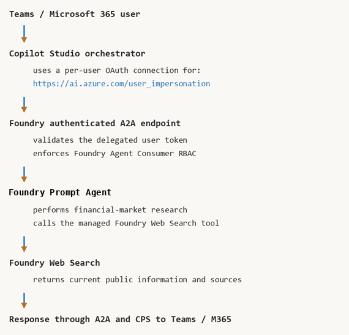
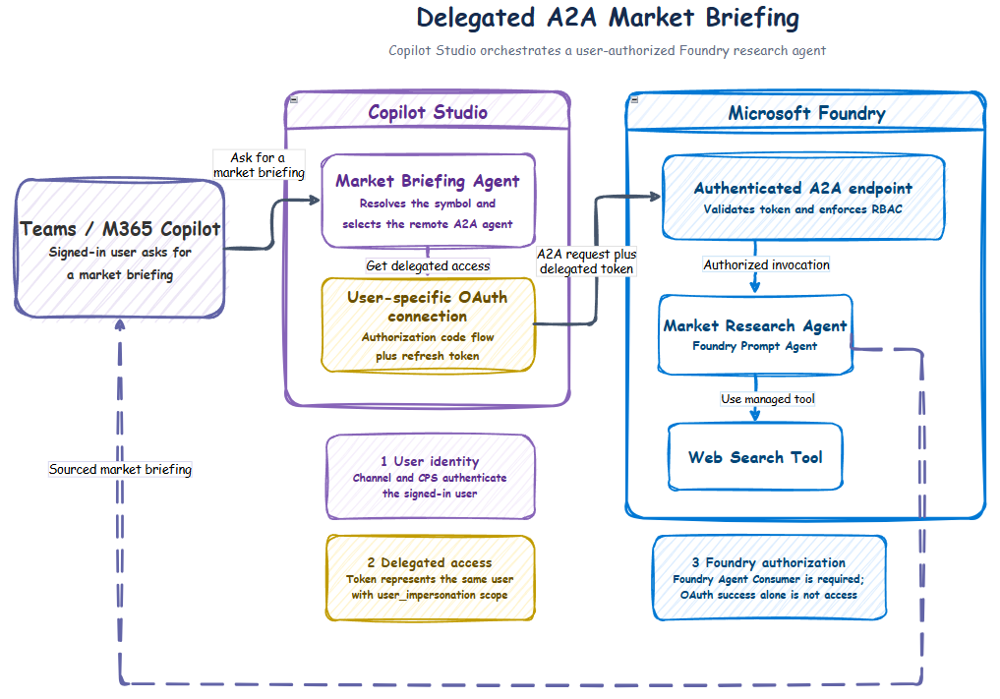

# 🔗 Copilot Studio agent with a Foundry A2A market-research agent

## End-to-end delegated multi-agent sample

This sample implements an attended, delegated multi-agent flow across Teams,
Microsoft 365 Copilot, Copilot Studio (CPS), and Microsoft Foundry.

💡 **Use case**

A user asks a Copilot Studio agent in Teams or Microsoft 365 Copilot for a
current market briefing on a public company or stock symbol. The CPS agent acts
as the orchestrator and delegates current financial research to a Prompt Agent
in Foundry through the Agent2Agent (A2A) protocol. The Prompt Agent uses Web
Search to gather a price snapshot, relevant news, catalysts, risks, and sources,
then returns a condensed report to CPS.

The end-to-end sequence is:

1. **💬 Receive the request:** the user asks the CPS agent for a market
   briefing in Teams, Microsoft 365 Copilot, or the CPS test experience.
2. **🧭 Resolve the company:** CPS identifies an exchange-qualified stock symbol
   and asks for clarification when the request is ambiguous.
3. **🎫 Obtain delegated access:** the CPS OAuth connection acquires an access
   token for `https://ai.azure.com` representing the signed-in user.
4. **🔐 Authorize the user:** Foundry validates the delegated token and evaluates
   the user's Azure RBAC assignment on the target agent.
5. **🤝 Delegate over A2A:** CPS sends the research task to the Foundry agent's
   authenticated A2A endpoint.
6. **🔎 Research current information:** the Foundry agent uses Web Search to
   retrieve current public financial and market information.
7. **📝 Return the briefing:** the Foundry agent returns its sourced analysis to
   CPS, which presents the result to the user.

The delegated token represents the end user. Foundry uses it to authorize the
A2A request before invoking the Prompt Agent. The agent does not receive the raw
Teams, Microsoft 365, or OAuth bearer token.



## Repository contents

📦 **What is included**

| Path | Purpose |
| --- | --- |
| `azure.yaml` | Foundry project and model deployment |
| `CPS-INSTRUCTIONS.txt` | Suggested instructions for the CPS agent |
| `requirements.txt` | Python SDK dependencies used to create the Prompt Agent |
| `scripts/deploy.ps1` | Deploys infrastructure, creates the Prompt Agent, and enables incoming A2A |
| `scripts/enable-a2a.ps1` | Adds the agent card, enables Responses and A2A, and validates the A2A 1.0 card |
| `scripts/create-oauth-app.ps1` | Creates the Entra OAuth client used by CPS |
| `scripts/grant-users.ps1` | Assigns **Foundry Agent Consumer** at agent scope |
| `scripts/register-cps-redirect.ps1` | Adds the CPS-generated OAuth redirect URI to the Entra app |
| `scripts/create-prompt-agent.py` | Creates a Prompt Agent with managed Web Search |

## Architecture and identity

🏗️ **Flow, trust boundaries, and delegated authorization**



There are three distinct identity layers:

1. **User → CPS**
   - Teams/M365 and CPS authenticate the user.
   - The CPS agent and channel must be shared with the user.

2. **CPS → Foundry**
   - CPS uses a user-specific OAuth connection.
   - The OAuth app requests:

     ```text
     https://ai.azure.com/user_impersonation
     ```

   - The resulting token represents the same signed-in user.

3. **Foundry authorization**
   - Foundry validates the token and enforces Azure RBAC.
   - The user or a security group containing the user needs **Foundry Agent
     Consumer** on the target agent or a suitable parent scope.
   - OAuth success alone does not grant access to the agent.

This design uses delegated authorization, but it is **not an OBO exchange inside
the Prompt Agent**. CPS obtains the delegated Foundry token directly through its
OAuth connection, and Foundry performs authorization before invoking the agent.

## Protocols used

🔌 **Each hop uses a different contract**

| Hop | Protocol |
| --- | --- |
| Teams/M365 → CPS | Microsoft 365/Copilot Studio channel activity |
| CPS → Foundry | A2A JSON-RPC over HTTPS |
| Foundry → model/tooling | Foundry Responses runtime and managed tools |
| Foundry agent → Web Search | Managed Foundry Web Search tool call |

Foundry publishes an authenticated A2A agent card and A2A endpoint. The setup
script enables both Responses and A2A on the stable agent endpoint.

## Current prerequisites and limitations

⚠️ **Read this section before provisioning**

- All participating users, the CPS environment, the OAuth application, and the
  Foundry project should be in the same Microsoft Entra tenant for this demo.
- CPS uses a user-specific OAuth connection for the remote agent. Each user can
  see a one-time connection or sign-in prompt on first invocation.
- Tenant-wide admin consent removes the delegated permission consent prompt, but
  it does not necessarily remove the one-time CPS connection sign-in.
- Every caller needs both access to the CPS agent and Foundry RBAC. A user can
  authenticate successfully and still receive `403 Forbidden` when **Foundry
  Agent Consumer** is missing.
- Foundry protects both the A2A endpoint and agent card. CPS might not
  automatically populate the remote agent's name and description; enter the
  metadata manually when necessary.
- Foundry exposes A2A 1.0 and A2A 0.3 behavior from the same endpoint. Enter the
  unversioned A2A communication endpoint in CPS. CPS generates an A2A 1.0 custom
  connector from the agent card; don't append an `a2a-version` query parameter
  while creating the connection because the CPS connector wizard rejects it.
- The current CPS-generated connector can omit the A2A version selector when it
  calls Foundry. Foundry then defaults the unversioned request to A2A 0.3 and
  rejects the connector's A2A 1.0 `SendMessage` method. After CPS creates the
  connector, add an internal `A2A-Version: 1.0` request header to its
  `InvokeA2A` operation as described in Step 5.
- Do not enable **Search all websites** on the CPS orchestrator for this demo.
  Otherwise CPS can silently answer with its own web search when the connected
  A2A agent fails, making a failed delegation look successful.
- Incoming Foundry A2A endpoints are currently supported only for **Prompt
  Agents**. This demo therefore creates that supported agent type. See [Enable
  incoming A2A on a Foundry
  agent](https://learn.microsoft.com/en-us/azure/foundry/agents/how-to/enable-agent-to-agent-endpoint)
  for the current supported agent types and setup requirements.
- A2A endpoint configuration is attached to the stable agent resource separately
  from immutable agent versions. Rerun `scripts/enable-a2a.ps1` after replacing
  or redeploying an agent version.
- General Web Search is not a licensed market-data feed. Quotes can be delayed,
  unavailable, or inconsistent. Use a market-data API for deterministic
  production pricing.
- Foundry Web Search can transfer search queries outside the Foundry compliance
  and geographic boundary. Review Grounding with Bing terms and organizational
  policy before enabling it.
- The OAuth script creates a client secret valid for one year. This is convenient
  for a demo; production deployments should use stronger credential-management
  and rotation practices.
- The sample provisions `gpt-5.4-mini` with Global Standard capacity. Model
  availability, quota, and permitted deployment types vary by subscription and
  region.
- Incoming A2A and CPS A2A integration are evolving capabilities. Portal
  labels, API versions, and supported protocol behavior can change.

## Required tools and permissions

🧰 **Developer tooling and administrative access**

- PowerShell 7 or Windows PowerShell.
- Azure CLI, signed in to the target tenant and subscription.
- Azure Developer CLI 1.27.1 or newer.
- Microsoft Foundry azd extension bundle:

  ```text
  azd ext install microsoft.foundry
  ```

- Python 3.12+ for Prompt Agent creation and local syntax checks.
- An Azure subscription with quota for the configured model.
- Permission to create:
  - Foundry accounts/projects and model deployments
  - Foundry agents and agent versions
  - Entra app registrations, service principals, and client secrets
  - Azure role assignments at the target agent scope
- **Foundry Project Manager** or equivalent deployment access.
- An Entra administrator for tenant-wide consent to
  `Azure Machine Learning Services/user_impersonation`.
- A Copilot Studio environment with permission to create agents, connections,
  and Teams/M365 channels.
- A Microsoft Entra security group containing the intended demo users is
  recommended for RBAC and CPS sharing.

## Configuration checklist

⚙️ **Values to record**

| Value | Where it is used |
| --- | --- |
| Azure subscription ID | azd deployment and resource IDs |
| Azure region | Foundry project and model deployment |
| Azure resource group | Foundry resource discovery and RBAC |
| Entra tenant ID | CPS OAuth authorization and token URLs |
| Foundry account name | Agent resource ID |
| Foundry project name | Agent resource ID and endpoint |
| Foundry project endpoint | Prompt Agent creation and A2A enablement |
| OAuth client ID | CPS A2A connection |
| OAuth client secret | CPS A2A connection |
| Security-group object ID | Foundry Agent Consumer role assignment |
| CPS-generated redirect URI | Entra web redirect URI |
| A2A v1 endpoint | CPS remote A2A agent configuration |

The deployment script passes the deployed project endpoint, model deployment,
and agent name to `scripts/create-prompt-agent.py`. 

## Step 1: Sign in and create an azd environment

1️⃣ **Outcome:** authenticated Azure and azd sessions with a selected deployment
environment.

From this scenario directory:

```text
az login
azd auth login
azd env new cps-a2a-demo
```

If the environment already exists:

```text
azd env select cps-a2a-demo
```

Set the required deployment values:

```text
azd env set AZURE_SUBSCRIPTION_ID "<subscription-id>"
azd env set AZURE_LOCATION "<azure-region>"
azd env set AZURE_RESOURCE_GROUP "<resource-group-name>"
azd env set AZURE_AI_MODEL_DEPLOYMENT_NAME "gpt-5.4-mini"
```

The project already contains `azure.yaml`; do not run `azd init`.

## Step 2: Deploy the Foundry project and Prompt Agent

2️⃣ **Outcome:** a Foundry project, model deployment, and Prompt Agent with
managed Web Search.

Run:

```text
.\scripts\deploy.ps1
```

The script:

1. Sets the model deployment value.
2. Runs `azd up --no-prompt`.
3. Resolves the deployed Foundry project endpoint.
4. Creates or versions the `market-research-agent` Prompt Agent with Web Search.
5. Adds the A2A agent card and enables incoming A2A.
6. Validates that the authenticated card advertises an A2A 1.0 JSON-RPC
   interface.
7. Prints the CPS A2A communication endpoint and v1 agent-card URL.

The manifest and deployment script create:

- Foundry project and `gpt-5.4-mini` deployment
- `market-research-agent` Prompt Agent
- Managed Web Search tool
- Responses endpoint with incoming A2A enabled

Record the exact values printed by the script:

```text
A2A base endpoint: https://<account>.services.ai.azure.com/api/projects/<project>/agents/market-research-agent/endpoint/protocols/a2a
CPS A2A URL:      https://<account>.services.ai.azure.com/api/projects/<project>/agents/market-research-agent/endpoint/protocols/a2a
A2A v1 card:      https://<account>.services.ai.azure.com/api/projects/<project>/agents/market-research-agent/endpoint/protocols/a2a/agentCard/v1.0
```

Use the **CPS A2A URL** exactly as printed when configuring CPS. Don't append a
protocol-version query parameter, and don't enter the agent-card URL.

To re-enable or verify A2A without redeploying:

```text
$projectEndpoint = azd env get-value AZURE_AI_PROJECT_ENDPOINT

.\scripts\enable-a2a.ps1 `
  -ProjectEndpoint $projectEndpoint `
  -AgentName "market-research-agent"
```

If `AZURE_AI_PROJECT_ENDPOINT` is empty, try the compatibility output name:

```text
$projectEndpoint = azd env get-value AZURE_AIPROJECT_ENDPOINT
```

## Step 3: Create the CPS OAuth application

3️⃣ **Outcome:** a single-tenant confidential OAuth client with delegated access
to Foundry.

Run:

```text
.\scripts\create-oauth-app.ps1
```

The script creates:

- A single-tenant Entra application
- Its service principal
- Delegated `Azure Machine Learning Services/user_impersonation` permission
- A one-year client secret

Record the displayed:

```text
Client ID
Client secret
```

The client secret is shown only once. Store it securely and never place it in
source control.

An Entra administrator must grant tenant-wide consent:

```text
az ad app permission admin-consent --id "<oauth-client-id>"
```

Alternatively, an administrator can create the application and grant consent in
one operation:

```text
.\scripts\create-oauth-app.ps1 -GrantAdminConsent
```

Verify the delegated permission:

```text
az ad app permission list --id "<oauth-client-id>" --output table
```

The application is an OAuth client for CPS; it does not grant Foundry resource
access by itself. Azure RBAC is configured separately in the next step.

## Step 4: Grant users access to the Foundry agent

4️⃣ **Outcome:** authorized users can invoke the target agent with delegated
identity.

Construct the target agent resource ID:

```text
/subscriptions/<subscription-id>/resourceGroups/<resource-group>/providers/Microsoft.CognitiveServices/accounts/<account>/projects/<project>/agents/market-research-agent
```

Grant a security group least-privilege access:

```text
.\scripts\grant-users.ps1 `
  -PrincipalObjectId "<security-group-object-id>" `
  -PrincipalType Group `
  -AgentResourceId "<agent-resource-id>"
```

For a single test user:

```text
.\scripts\grant-users.ps1 `
  -PrincipalObjectId "<user-object-id>" `
  -PrincipalType User `
  -AgentResourceId "<agent-resource-id>"
```

The script assigns **Foundry Agent Consumer** using role-definition ID:

```text
eed3b665-ab3a-47b6-8f48-c9382fb1dad6
```

Allow several minutes for role-assignment propagation. Verify:

```text
az role assignment list `
  --scope "<agent-resource-id>" `
  --include-inherited `
  --output table
```

## Step 5: Create the Copilot Studio agent

5️⃣ **Outcome:** a CPS agent that delegates market research to Foundry over A2A.

1. Open Copilot Studio in the same Entra tenant. Use the new CPS experience.
2. Create an agent named `Market Briefing Orchestrator`.
3. Apply the instructions from `CPS-INSTRUCTIONS.txt`.
4. Under **Settings → Safety & access → Authentication**, select **Authenticate with
   Microsoft**.
5. Remove **Search all websites** under **Knowledge** so a failed A2A call cannot
   silently fall back to CPS web search.
6. Open **Connected Agents → + → Add A2A agent**.
7. Enter the unversioned **CPS A2A URL** printed by the deployment:

   ```text
   https://<account>.services.ai.azure.com/api/projects/<project>/agents/market-research-agent/endpoint/protocols/a2a
   ```

8. Select **OAuth 2.0** and configure:

| Field | Value |
| --- | --- |
| Client ID | ID printed by `create-oauth-app.ps1` |
| Client secret | Secret printed by the script |
| Authorization URL | `https://login.microsoftonline.com/<tenant-id>/oauth2/v2.0/authorize` |
| Token URL | `https://login.microsoftonline.com/<tenant-id>/oauth2/v2.0/token` |
| Refresh URL | Same as the token URL |
| Scopes | `https://ai.azure.com/user_impersonation offline_access openid profile` |

9. Save or create the OAuth connection.
10. If CPS cannot read the protected card automatically, enter:
   - Name: `Market Research`
   - Description: `Finds current prices, news, catalysts, and risks.`
11. Copy the redirect URI generated for the CPS connection.

Do not omit `offline_access`; CPS needs a refresh token to reuse the
user-specific connection.

### Apply the A2A 1.0 connector workaround

⚠️ **Required for the current CPS-generated connector**

The generated connector declares `x-ms-agentic-protocol: a2a-1.0`, but it can
forward requests to Foundry without an `A2A-Version` header or `a2a-version`
query parameter. Foundry then treats the request as A2A 0.3 and rejects
`SendMessage` before the agent runs.

Configure a request policy on the Power Apps custom connector:

1. Open [Power Apps](https://make.powerapps.com/) and select the CPS
   environment.
2. Open **Custom connectors**.
3. Find the connector created for the A2A agent, for example
   **Market Research Agent**, and select **Edit**.
4. Open **3. Definition**.
5. Expand **Policies** and select **+ New policy**.
6. Configure the policy exactly as follows:

   | Field | Value |
   | --- | --- |
   | Name | `Set A2A version` |
   | Template | **Set HTTP header** |
   | Operations | `InvokeA2A` |
   | Header name | `A2A-Version` |
   | Header value | `1.0` |
   | Action if header exists | **override** |
   | Run policy on | **Request** |

   The **Operations** field must explicitly contain `InvokeA2A`. Leaving it
   empty doesn't reliably scope the policy to the generated A2A operation.

7. Select **Update connector** at the top of the page.
8. Open **5. Test** and reconnect the OAuth connection if Power Platform
   requests it.
9. Republish the CPS agent and start a new CPS or M365 conversation.

Do not change the connector's Host or Base URL, and don't append an
`a2a-version` query parameter to the endpoint. The request policy adds the
required version selector at runtime.

## Step 6: Register the CPS OAuth redirect URI

6️⃣ **Outcome:** Entra can complete the CPS authorization-code flow.

Register the exact URI generated by CPS:

```text
.\scripts\register-cps-redirect.ps1 `
  -ClientId "<oauth-client-id>" `
  -RedirectUri "<generated-CPS-redirect-URI>"
```

The script preserves existing web redirect URIs and adds the new URI.

Verify:

```text
az ad app show \
  --id "<oauth-client-id>" \
  --query web.redirectUris \
  --output table
```

Then return to Copilot Studio:

1. Authenticate the OAuth connection.
2. Select **Add and configure** for the remote agent.
3. Confirm that the CPS agent can select the A2A agent.
4. Publish the CPS agent.

If the OAuth connection is recreated, CPS can generate a new redirect URI.
Register the new value before testing again.

## Step 7: Publish CPS to Teams and Microsoft 365 Copilot

7️⃣ **Outcome:** users can invoke the CPS agent from attended Microsoft
365 clients.

1. In CPS, open **Channels → Teams and Microsoft 365 Copilot**.
2. Enable Microsoft 365 Copilot.
3. Publish initially for yourself.
4. Install and test the agent.
5. Share the CPS agent with the same users or security group used for Foundry
   RBAC.
6. For organization-wide discovery, complete the required admin approval and
   Teams/Microsoft 365 app publication process.

Channel publication and app-store changes can take several minutes to
propagate.

## Step 8: Run the demo

8️⃣ **Outcome:** a sourced market briefing returned through the complete
delegated A2A flow.

Ask:

```text
Give me a current market briefing for NASDAQ:MSFT. If markets are closed,
use the latest regular-session close and clearly label its date.
```

On the first A2A invocation, CPS can display a separate OAuth connection prompt.
The existing Teams browser session can normally be reused. With tenant-wide
admin consent, the user should not need to approve the delegated permission, but
a one-time connection sign-in can still appear.

Afterward, CPS stores user-specific access and refresh tokens and should not
prompt again unless:

- The grant or connection is revoked.
- The client secret or CPS connection is replaced.
- The refresh token expires.
- Conditional Access requires reauthentication.

The response should contain:

- Exchange-qualified symbol
- Latest verifiable price and currency
- Market state and as-of time
- Recent material news
- Catalysts and risks
- Source links
- Informational-only disclaimer

## Step 9: Demonstrate delegated authorization

9️⃣ **Outcome:** evidence that Foundry enforces the signed-in user's identity.

Use two same-tenant test users:

| User | CPS access | Foundry Agent Consumer | Expected result |
| --- | --- | --- | --- |
| Authorized user | Yes | Yes | OAuth and A2A call succeed |
| Denied user | Yes | No | OAuth succeeds, Foundry returns `403` |

Both users can authenticate through the same CPS OAuth application. Their
different results come from Foundry RBAC, demonstrating that the A2A request is
authorized as the end user rather than as a shared application identity.

## Verify and monitor each hop

🔎 **Collect evidence independently**

### Copilot Studio

- Use the CPS test pane before publishing.
- Confirm that the A2A agent is selected in the activity map.
- Inspect connection prompts and authentication failures.
- Review **Analytics/Activity/Monitor** experiences available for the agent and
  environment.

### Foundry

- Open the project and target agent.
- Review invocation traces, tool calls, and Web Search execution.
- Confirm the request reached the stable A2A endpoint and selected agent version.
- Check that the calling user has an effective **Foundry Agent Consumer**
  assignment.

### A2A card

The card is authenticated. Validate it with an Azure CLI token:

```text
$projectEndpoint = azd env get-value FOUNDRY_PROJECT_ENDPOINT
$agentName = azd env get-value AGENT_MARKET_RESEARCH_AGENT_NAME
$token = azd auth token --scope https://ai.azure.com/.default

$headers = @{ Authorization = "Bearer $token" }
$cardUrl = "$projectEndpoint/agents/$agentName/endpoint/protocols/a2a/agentCard/v1.0"

Invoke-RestMethod -Uri $cardUrl -Headers $headers
```

The card should advertise a JSON-RPC interface with protocol version `1.0`.

## Local validation

🧪 **Validate source without attempting the complete delegated flow**

```powershell
python -m compileall -q .\scripts\create-prompt-agent.py
```

This validates the Prompt Agent creation script. The complete CPS
user-specific OAuth and Foundry A2A authorization boundary still requires the
deployed end-to-end environment.

## Troubleshooting

🩺 **Fast symptom-to-cause guide**

| Symptom | Likely cause | Resolution |
| --- | --- | --- |
| CPS cannot discover the remote agent | Foundry card requires authentication, URL is wrong, or metadata discovery failed | Use the printed unversioned A2A URL and enter agent name/description manually |
| CPS says it delegated but no Foundry trace appears | CPS selected its own web search, or the generated connector omitted the A2A version selector | Remove **Search all websites** and add the internal `A2A-Version: 1.0` header to `InvokeA2A` |
| `Couldn't create the A2A connector` | A version query was appended to the endpoint, or a custom connector with the same generated name already exists | Use the unversioned endpoint; reuse the existing connected agent or remove the stale custom connector before recreating it |
| Connector returns `Invalid JSON-RPC request: 'method' field is not a valid A2A method` | CPS sent A2A 1.0 `SendMessage`, but Foundry defaulted the unversioned request to A2A 0.3 | Add the internal `A2A-Version: 1.0` request header to the connector operation |
| OAuth sign-in fails immediately | Incorrect tenant endpoint, client ID, secret, scope, or redirect URI | Compare every CPS OAuth field and register the exact generated redirect URI |
| `AADSTS50011` redirect mismatch | CPS-generated redirect URI is absent from the Entra app | Run `register-cps-redirect.ps1` with the exact URI |
| User receives `401` from A2A | Token was not issued for `https://ai.azure.com` | Use `https://ai.azure.com/user_impersonation`; recreate the CPS connection if fields changed |
| User receives `403` after successful OAuth | Missing or unpropagated Foundry RBAC | Assign **Foundry Agent Consumer** to the user/group and allow propagation time |
| Consent or connection prompt repeats | `offline_access` is missing, refresh token expired, or connection was recreated | Include all documented scopes and reconnect the user |
| Incoming A2A cannot be enabled | The target is not a Prompt Agent or lacks the Responses protocol | Create the Prompt Agent with `deploy.ps1` and review the supported agent types in the linked Foundry A2A documentation |
| A2A endpoint or card is missing after redeployment | Stable endpoint configuration was not reapplied | Rerun `enable-a2a.ps1` for the target agent |
| Agent starts but Web Search is unavailable | The managed tool is unavailable or user/project lacks access | Verify the Prompt Agent tool definition and Foundry permissions |
| No current or reliable stock price | General Web Search returned delayed or incomplete data | Retry with an exchange-qualified symbol; use a licensed quote API in production |
| Teams/M365 shows an old configuration | Channel publication or client cache has not propagated | Republish, wait, and start a new conversation |
| Prompt Agent creation fails | Missing Python packages, project endpoint, model deployment, or CLI access | Activate the venv, set both environment variables, and verify Azure CLI sign-in |

## OAuth secret rotation

🔄 **Rotate the credential without breaking CPS**

The OAuth client secret is stored in the CPS connection. When rotating:

1. Create a new Entra application credential.
2. Update or recreate the CPS OAuth connection with the new secret.
3. Register any newly generated CPS redirect URI.
4. Reauthenticate affected users if CPS requests it.
5. Verify an authorized A2A invocation.
6. Delete the old credential only after successful validation.

Because CPS connection properties can be difficult to edit reliably after
creation, recreating the connection is often safer than partially changing its
OAuth settings.

## Production recommendations

🛡️ **Move from demo convenience to production readiness**

- Use a licensed market-data API for deterministic pricing.
- Store and rotate OAuth credentials through an approved secret-management
  process; use stronger credential types where the integration supports them.
- Scope **Foundry Agent Consumer** to dedicated groups and the narrowest useful
  agent resource.
- Define lifecycle processes for user access, consent revocation, secret
  rotation, and departed users.
- Pin and regression-test the A2A protocol version supported by both CPS and
  Foundry before each rollout.
- Add end-to-end correlation IDs, operational dashboards, latency/error metrics,
  and alerts across CPS, Entra, and Foundry.
- Add source allowlists, prompt-injection defenses, content-safety policy,
  request limits, and financial-domain evaluation.
- Review Web Search data-boundary, privacy, and compliance implications.
- Define SLOs, retry behavior, timeouts, and fallback messaging for unavailable
  remote agents or search providers.

## References

📚 **Primary product documentation**

- [Enable incoming A2A on a Foundry agent](https://learn.microsoft.com/azure/foundry/agents/how-to/enable-agent-to-agent-endpoint)
- [Foundry A2A authentication](https://learn.microsoft.com/azure/foundry/agents/concepts/agent-to-agent-authentication)
- [Connect Copilot Studio to an A2A agent](https://learn.microsoft.com/microsoft-copilot-studio/add-agent-agent-to-agent)
- [Foundry Web Search](https://learn.microsoft.com/azure/foundry/agents/how-to/tools/web-search)
- [Azure RBAC for Foundry](https://learn.microsoft.com/azure/foundry/concepts/rbac-foundry)
