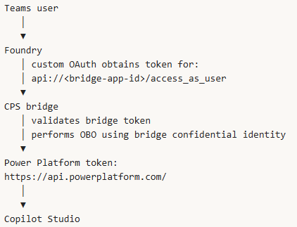
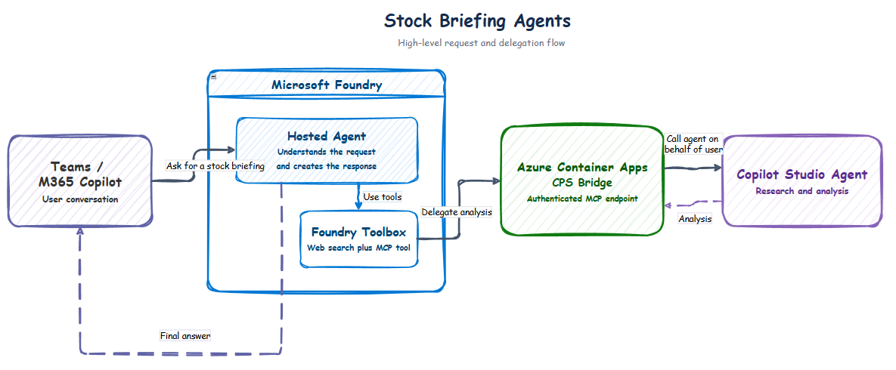

# 📈 Foundry Hosted Stock Agent with Delegated Copilot Studio Analysis

This sample implements an attended, delegated multi-agent flow across Teams, Microsoft 365 Copilot, a Foundry Hosted Agent, and a Copilot Studio (CPS) Agent.

## 🧭 Navigation

- [Use case](#-use-case)
- [Repository contents](#-repository-contents)
- [At a glance](#-at-a-glance)
- [Architecture and identity](#-architecture-and-identity)
- [Protocols used](#-protocols-used)
- [Prerequisites and limitations](#-current-prerequisites-and-limitations)
- [Deployment steps](#step-1-create-the-standard-copilot-studio-analyst)
- [Verification](#step-8-verify-each-hop)
- [Local validation](#-local-validation)
- [Troubleshooting](#-troubleshooting)
- [Production recommendations](#-production-recommendations)

## 💡 Use case

A user asks the agent in Teams or Microsoft 365 Copilot for a current market
briefing on a stock symbol (e.g. `MSFT`). The Foundry Hosted Agent coordinates two
complementary capabilities: Foundry Web Search retrieves the latest available
market price, while a Copilot Studio agent performs broader financial research.
An authenticated MCP bridge connects the two agent platforms and preserves the
signed-in user's delegated identity through the Microsoft Entra on-behalf-of
(OBO) flow.

The end-to-end sequence is:

1. **🔎 Find the current price:** Foundry Web Search finds the latest available
   price of a stock symbol together with its currency, market state, timestamp, and source.
2. **🎫 Obtain delegated access:** Foundry obtains a delegated user token for
   the CPS Bridge through the Toolbox connection.
3. **✅ Validate the caller:** The bridge validates the token's signature,
   issuer, audience, expiry, tenant, and required delegated scope.
4. **🔐 Exchange the token:** The bridge performs the Microsoft Entra OBO flow
   to obtain a Power Platform token representing the same signed-in user.
5. **📊 Research the market context:** The bridge calls the Copilot Studio
   agent, which researches current company information, price drivers, material
   news, upcoming catalysts, risks, and supporting sources.
6. **📝 Return the briefing:** The Hosted Agent combines the price snapshot and
   Copilot Studio analysis into a concise, sourced report and returns it to the
   user in Teams or Microsoft 365 Copilot.

The bridge is required because Foundry does not expose the raw Teams/M365 bearer
token to Hosted Agent container code. Foundry brokers a user-specific OAuth token
for the bridge; the bridge validates that token and performs OBO for the Power
Platform audience required by Copilot Studio.



## 📦 Repository contents

| Path | Purpose |
| --- | --- |
| `hosted-agent/` | Python Agent Framework Hosted Agent using Responses protocol 2.0 |
| `cps-bridge/` | OAuth-protected MCP server and Copilot Studio client |
| `copilot-studio/INSTRUCTIONS.txt` | Suggested instructions for the CPS analyst |
| `azure.yaml` | Foundry project, model, OAuth connection, toolbox, and Hosted Agent |
| `docker-compose.yml` | Local startup for both containers |
| `docs/` | Editable and rendered architecture diagrams |

## 🧩 At a glance

| Component | Role | Primary contract |
| --- | --- | --- |
| Teams / Microsoft 365 Copilot | User-facing conversation channel | Activity protocol |
| Foundry Hosted Agent | Orchestrates price lookup and market analysis | Responses 2.0 |
| Foundry Web Search | Retrieves current public price evidence | Managed tool invocation |
| ACA CPS Bridge | Validates delegated access and connects to CPS | MCP over HTTPS and OAuth |
| Copilot Studio Agent | Researches company context, catalysts, and risks | Activity messages and SSE |
| Microsoft Entra ID | Exchanges the delegated assertion for CPS access | OAuth 2.0 OBO |

## 🏗️ Architecture and identity



Identity crosses two separate authorization boundaries:

1. **Foundry → Bridge**
   - Foundry's custom OAuth connection requests:

     ```text
     api://<bridge-client-id>/access_as_user
     ```

   - The bridge validates issuer, tenant, audience, expiry, signature, and
     `access_as_user`.

2. **Bridge → Copilot Studio**
   - The bridge uses the incoming access token as an OBO assertion.
   - Microsoft Entra issues a delegated token for the Power Platform audience.
   - The token carries:

     ```text
     CopilotStudio.Copilots.Invoke
     ```

## 🔌 Protocols used

| Hop | Protocol |
| --- | --- |
| Teams/M365 → Foundry | Microsoft 365/Bot Service **Activity protocol** |
| Foundry platform → Hosted Agent container | Foundry **Responses protocol 2.0** |
| Hosted Agent → Foundry Web Search | Managed Foundry Toolbox/Web Search invocation |
| Hosted Agent → ACA bridge | **MCP Streamable HTTP** over HTTPS |
| Foundry OAuth connection → bridge | OAuth 2.0 delegated access token for `access_as_user` |
| ACA bridge → Microsoft Entra | OAuth 2.0 **On-Behalf-Of (OBO)** token exchange |
| ACA bridge → CPS agent | CPS authenticated conversation API using Activity messages |
| CPS agent → ACA bridge | **Server-Sent Events (SSE)** carrying Activity JSON |
| Foundry → Teams/M365 | Activity protocol response |

The bridge returns the CPS result as an MCP tool response, and Foundry returns
the final answer to the user through the Activity channel. **A2A isn't used in
this demo.** Azure Container Apps only hosts the bridge; it doesn't introduce a
separate application protocol.

## ⚠️ Current prerequisites and limitations

### Copilot Studio compatibility

> [!IMPORTANT]
> The target CPS agent must use the **Standard harness**. `CopilotClient` and
> the authenticated agent-execution API don't support agents powered by the
> GitHub Copilot harness.

The unsupported harness returns:

```text
This action doesn't support agents built with the GitHub Copilot harness.
```

- Create a Standard agent by turning off **New experience** on the Copilot Studio
  home page, or selecting **Other ways to build**.
- The Standard CPS agent must be published before the bridge can invoke it.
- CPS public-web research is configured in the **Conversational boosting**
  system topic:

  ```text
  Create generative answers
    → Data sources
    → Classic data
    → Search public websites
  ```

- The bridge contains a compatibility shim for CPS citations carrying JSON-LD
  `@id`, which Microsoft Agents Activity SDK 1.7.0 doesn't deserialize. The shim
  removes only the unsupported identifier and preserves citation text and URLs.

### Identity and consent

- The demo uses one Entra app registration as both OAuth client and bridge API.
  This works for a demo but keeps inbound bridge consent and downstream CPS
  consent on one service principal. Use two app registrations in production.

> [!NOTE]
> Foundry custom OAuth is user-specific. The first invocation can return a
> consent link; after authorization, retry the original request.

- Users invoking OAuth-backed tools need **Foundry Agent Consumer** or higher on
  the calling Foundry project/agent.
- All participating identities must currently be in the same Entra tenant;
  cross-tenant token exchange isn't supported by this design.
- Custom OAuth connection settings are effectively immutable. Recreate the
  connection after changing its client, secret, endpoints, or scopes, and
  register the newly generated redirect URI.

### Search and data boundaries

> [!WARNING]
> General Web Search isn't a market-data service. Quotes can be delayed,
> unavailable, or inconsistent. Use a licensed quote API for deterministic
> production pricing.

- Grounding with Bing can transfer search queries outside Foundry/Power Platform
  compliance or geographic boundaries. Review the applicable terms and policy.

### Deployment and channel behavior

- Teams/M365 publication and app-store changes can take several minutes to
  propagate. OAuth consent might render more reliably in the Foundry Playground.

## 🧰 Required tools and permissions

- Azure CLI, signed in to the target subscription.
- Azure Developer CLI 1.27.1 or newer.
- Microsoft Foundry azd extension:

  ```text
  azd ext install microsoft.foundry
  ```

- Python 3.12+ for local validation.
- Docker, or Azure Container Registry source builds.
- Permission to create:
  - Entra app registrations and service principals
  - Azure Container Apps and Azure Container Registry resources
  - Foundry projects, deployments, toolboxes, connections, and agents
  - Azure Bot Service resources when publishing to Teams/M365
- An Entra administrator for tenant-wide delegated consent.
- Copilot Studio maker permissions in the target environment.

## ⚙️ Environment templates

The repository contains three safe templates:

| File | Used by |
| --- | --- |
| `.env.example` | End-to-end deployment reference and azd inputs |
| `cps-bridge/.env.example` | Bridge runtime/local container |
| `hosted-agent/.env.example` | Hosted Agent runtime/local container |

The root `.env.example` is a reference checklist; azd doesn't import it
automatically. Set its deployment values with `azd env set`. The two component
templates can be copied to `.env` for local Docker Compose runs.

Never commit populated `.env` files or `.azure/` state. Both are excluded by
`.gitignore`.

## Step 1: Create the Standard Copilot Studio analyst

1️⃣ **Outcome:** a published Standard-harness CPS agent with public-web research.

1. Open Copilot Studio in the same Entra tenant.
2. Turn off **New experience**, or choose **Other ways to build**.
3. Create a **Standard harness** agent.
4. Apply `copilot-studio/INSTRUCTIONS.txt`.
5. Enable broader public-web research:

   ```text
   Topics
   → System
   → Conversational boosting
   → Create generative answers
   → Data sources
   → Classic data
   → Search public websites
   ```

6. Configure authentication and sharing so intended users can invoke it.
7. Publish the agent.
8. Open **Settings → Advanced → Metadata** and record:
   - Environment ID, for example
     `Default-<GUID>`
   - Schema name, for example `new_FinancialMarketResearchAgent`

## Step 2: Create the bridge Entra application

2️⃣ **Outcome:** a single-tenant resource API and confidential OBO client for
the demo.

Create a single-tenant app registration, for example:

```text
Stock CPS OBO Bridge
```

Record:

- Directory/tenant ID
- Application/client ID

### 🪪 Expose the bridge API

Under **Expose an API**:

1. Set the Application ID URI:

   ```text
   api://<bridge-client-id>
   ```

2. Add delegated scope:

   ```text
   access_as_user
   ```

3. Allow admin and user consent as appropriate for the tenant.
4. In the app manifest, set:

   ```json
   "requestedAccessTokenVersion": 2
   ```

### 🔐 Add downstream CPS permission

Under **API permissions**, add:

```text
Power Platform API
└── Delegated permissions
    └── CopilotStudio.Copilots.Invoke
```

Grant tenant-wide admin consent:

```text
az ad app permission admin-consent --id <bridge-client-id>
```

Verify the downstream grant:

```text
az ad app permission list-grants `
  --id <bridge-client-id> `
  --output table
```

The output should contain `CopilotStudio.Copilots.Invoke`.

### 🔑 Create the demo credential

Create a short-lived client secret and record its value. The same current
secret is required by:

- The Container App bridge for OBO.
- The Foundry custom OAuth connection.

Store it only in Container Apps secret storage and the ignored azd environment.
For production, use separate client/resource apps and certificate or federated
credentials where supported.

### 👥 Optional enterprise-app assignment

If **Assignment required** is enabled under the Enterprise Application:

```text
Entra ID
→ Enterprise applications
→ Stock CPS OBO Bridge
→ Users and groups
```

assign every user/group that must authorize the Foundry connection.

## Step 3: Deploy the bridge to Azure Container Apps

3️⃣ **Outcome:** a public HTTPS MCP endpoint protected by Microsoft Entra OAuth.

Sign in and choose values:

```text
az login
az account set --subscription "<subscription-id>"

$resourceGroup = "rg-stock-agent-demo"
$location = "swedencentral"
$bridgeName = "cps-stock-bridge"
$tenantId = "<tenant-id>"
$bridgeClientId = "<bridge-client-id>"
$bridgeClientSecret = "<bridge-client-secret-value>"
$cpsEnvironmentId = "<cps-environment-id>"
$cpsSchemaName = "<standard-cps-schema-name>"
```

Create the resource group and deploy source:

```text
az group create `
  --name $resourceGroup `
  --location $location

az containerapp up `
  --name $bridgeName `
  --resource-group $resourceGroup `
  --location $location `
  --source .\cps-bridge `
  --ingress external `
  --target-port 8000
```

The first revision can be unhealthy until required settings are added.

Resolve the public MCP URL:

```text
$fqdn = az containerapp show `
  --name $bridgeName `
  --resource-group $resourceGroup `
  --query properties.configuration.ingress.fqdn `
  --output tsv

$bridgeUrl = "https://$fqdn/mcp"
```

Store the confidential credential:

```text
az containerapp secret set `
  --name $bridgeName `
  --resource-group $resourceGroup `
  --secrets "cps-client-secret=$bridgeClientSecret"
```

Configure runtime values:

```text
az containerapp update `
  --name $bridgeName `
  --resource-group $resourceGroup `
  --set-env-vars `
    "AZURE_TENANT_ID=$tenantId" `
    "CPS_BRIDGE_CLIENT_ID=$bridgeClientId" `
    "CPS_BRIDGE_CLIENT_SECRET=secretref:cps-client-secret" `
    "CPS_BRIDGE_AUDIENCE=api://$bridgeClientId" `
    "CPS_BRIDGE_REQUIRED_SCOPE=access_as_user" `
    "CPS_BRIDGE_URL=$bridgeUrl" `
    "COPILOT_STUDIO_ENVIRONMENT_ID=$cpsEnvironmentId" `
    "COPILOT_STUDIO_SCHEMA_NAME=$cpsSchemaName" `
    "HOST=0.0.0.0" `
    "PORT=8000" `
  --min-replicas 1 `
  --max-replicas 1
```

Verify the revision:

```text
az containerapp show `
  --resource-group $resourceGroup `
  --name $bridgeName `
  --query "{running:properties.runningStatus,ready:properties.latestReadyRevisionName}"
```

An unauthenticated MCP request should return `401`:

```text
(Invoke-WebRequest $bridgeUrl -SkipHttpErrorCheck).StatusCode
```

## Step 4: Configure and deploy Foundry with azd

4️⃣ **Outcome:** Foundry project, toolbox, OAuth connection, and Hosted Agent.

The project already contains `azure.yaml`; do not run `azd init`.

Create/select an environment first:

```text
azd auth login
azd env new stock-agent-demo
```

If it already exists:

```text
azd env select stock-agent-demo
```

Set all manifest inputs:

```text
azd env set AZURE_SUBSCRIPTION_ID "<subscription-id>"
azd env set AZURE_LOCATION "swedencentral"
azd env set AZURE_RESOURCE_GROUP "rg-stock-agent-demo"
azd env set AZURE_AI_MODEL_DEPLOYMENT_NAME "gpt-5.4-mini"
azd env set AZURE_TENANT_ID $tenantId
azd env set CPS_BRIDGE_URL $bridgeUrl
azd env set CPS_BRIDGE_CLIENT_ID $bridgeClientId
azd env set CPS_BRIDGE_CLIENT_SECRET $bridgeClientSecret
```

Deploy:

```text
azd up --no-prompt
```

The manifest creates:

- Foundry project and `gpt-5.4-mini` deployment
- `cps-bridge-connection` using custom OAuth2
- `stock-tools` Foundry Toolbox containing Web Search and the MCP bridge
- `stock-market-agent` Foundry Hosted Agent using Responses 2.0

## Step 5: Register Foundry's OAuth redirect URI

5️⃣ **Outcome:** Entra can complete Foundry's managed OAuth authorization-code
flow.

Custom OAuth generates a redirect URI only after the Foundry connection exists.
Retrieve and register it:

```text
$projectId = azd env get-value AZURE_AI_PROJECT_ID

$redirectUri = az rest `
  --method get `
  --url "https://management.azure.com$projectId/connections/cps-bridge-connection?api-version=2025-06-01" `
  --query properties.redirectUrl `
  --output tsv

$existingRedirects = @(
  az ad app show `
    --id $bridgeClientId `
    --query web.redirectUris `
    --output tsv
)

$allRedirects = @(
  $existingRedirects + $redirectUri |
    Where-Object { $_ } |
    Sort-Object -Unique
)

az ad app update `
  --id $bridgeClientId `
  --web-redirect-uris $allRedirects
```

Verify the complete connection without exposing its secret:

```text
az rest `
  --method get `
  --url "https://management.azure.com$projectId/connections/cps-bridge-connection?api-version=2025-06-01" `
  --query "{authType:properties.authType,target:properties.target,authorizationUrl:properties.authorizationUrl,tokenUrl:properties.tokenUrl,scopes:properties.scopes,redirectUrl:properties.redirectUrl,error:properties.error}"
```

## Step 6: Establish inbound user consent

6️⃣ **Outcome:** the signed-in user has a reusable OAuth grant for the bridge.

The first OAuth-backed bridge call can return a consent request for:

```text
api://<bridge-client-id>/access_as_user
```

Use the Foundry Playground with the same end user:

1. Open `stock-market-agent`.
2. Ask:

   ```text
   Give me a current market briefing for NASDAQ:MSFT. If markets are closed,
   use the latest regular-session close and clearly label its date.
   ```

3. Open the returned consent link.
4. Sign in and authorize.
5. Submit the request again.

If the M365 channel renders only a sign-in-complete message, establish consent in
the Playground first, then retry in M365.

There are two grants to verify:

```text
# Downstream bridge → Power Platform
az ad app permission list-grants `
  --id $bridgeClientId `
  --output table

# Inbound user/client → bridge API
$bridgeServicePrincipalId = az ad sp show `
  --id $bridgeClientId `
  --query id `
  --output tsv

az rest `
  --method get `
  --url "https://graph.microsoft.com/v1.0/oauth2PermissionGrants?`$filter=resourceId eq '$bridgeServicePrincipalId'&`$select=consentType,principalId,scope,clientId,resourceId"
```

Expected scopes:

```text
access_as_user
CopilotStudio.Copilots.Invoke
```

## Step 7: Publish to Teams and Microsoft 365 Copilot

7️⃣ **Outcome:** users can invoke the stable Foundry endpoint from attended M365
channels.

1. Test the active version in Foundry.
2. Open **Publish → Teams and Microsoft 365 Copilot**.
3. For personal testing, choose **Just you/shared**.
4. For organization discovery, choose **People in your organization**, submit
   for admin approval, and publish it in the Microsoft 365 admin center.
5. Ensure the app is **Allowed** in Teams admin center.
6. Install/open the agent in Teams or M365 Copilot.
7. Start a new conversation and run the NASDAQ:MSFT prompt above.

Users of OAuth-backed tools should have **Foundry Agent Consumer** or higher on
the Foundry project or agent.

Channel publication can take several minutes to propagate. A Shared publication
is normally installed through its direct link and might not be searchable in the
Teams store.

## Step 8: Verify each hop

8️⃣ **Outcome:** independent evidence for Foundry, bridge/OBO, and CPS execution.

### 🔎 Foundry trace

The response trace should show:

```text
stock-price-web-search
→ copilot-studio-stock-analysis___analyze_stock
→ tool result
```

### 📋 Bridge logs and OBO evidence

```text
az containerapp logs show `
  --resource-group $resourceGroup `
  --name $bridgeName `
  --follow
```

Successful lifecycle entries are structured JSON and include:

- Foundry/MCP request ID
- CPS conversation ID
- Symbol
- UTC start/end time
- Duration in milliseconds
- CPS message-activity count
- Success/failure category

No tokens, client secrets, prompts, or full CPS responses are logged.

### 📊 Copilot Studio Monitor

Open the Standard CPS agent and select **Monitor**. API conversations can take
up to an hour to appear and transcripts normally appear after the session ends.
Copilot Studio test-panel traffic isn't included in Monitor.

For near-real-time CPS telemetry:

1. Create/select Application Insights.
2. Copy its connection string.
3. Open CPS **Settings → Advanced → Application Insights**.
4. Enable:
   - Enable logging
   - Log conversation details
   - Node execution events
5. Keep sensitive Activity-property logging off unless policy explicitly allows
   it.
6. Republish the CPS agent.

## 🧪 Local validation

```text
python -m venv .venv
& .\.venv\Scripts\python.exe -m pip install `
  -r .\cps-bridge\requirements-dev.txt

$env:PYTHONPATH = ".\cps-bridge"
& .\.venv\Scripts\python.exe -m pytest .\cps-bridge\tests
& .\.venv\Scripts\python.exe -m compileall -q .\cps-bridge .\hosted-agent
```

For local containers:

```text
Copy-Item .\cps-bridge\.env.example .\cps-bridge\.env
Copy-Item .\hosted-agent\.env.example .\hosted-agent\.env
docker compose up --build
```

A local `/responses` call has no M365 end-user identity. It can test startup and
Web Search, but not the complete delegated OBO flow unless the caller supplies
the required identity through Foundry.

## 🩺 Troubleshooting

| Symptom | Likely cause | Resolution |
| --- | --- | --- |
| `401 invalid_token` before tool discovery | Missing/stale inbound `access_as_user` consent | Reauthorize the Foundry OAuth connection; verify grants to the bridge API |
| OBO `invalid_grant` or tool fails immediately | Missing `CopilotStudio.Copilots.Invoke` consent or mismatched secret | Grant consent; synchronize the current app secret in Container Apps and azd |
| `GitHub Copilot harness not supported` | CPS target uses the wrong harness | Create and publish a Standard-harness CPS agent; update bridge metadata |
| `ClientCitation ... has no field at_id` | CPS Web Search emitted newer citation metadata | Deploy the included citation-compatible bridge client |
| Bridge logs only `ListToolsRequest` | Foundry discovered tools but didn't call CPS bridge | Inspect Web Search result and Foundry orchestration trace |
| No current stock price | General Web Search returned no usable quote | Retry with exchange-qualified symbol; use a licensed quote API for reliability |
| Consent completes but M365 still pauses | First request was consumed by OAuth or channel cache | Start over/new conversation and resend; establish consent in Playground |
| CPS sessions unavailable | Missing Dataverse transcript role | Assign **Bot Transcript Viewer** through environment Security roles |
| Custom OAuth fields look blank in portal | Portal doesn't hydrate immutable fields | Inspect the ARM connection with `az rest`; recreate to change OAuth settings |

## 🔄 Secret rotation

The bridge client secret is used in two places:

- Container Apps secret `cps-client-secret`
- Foundry custom OAuth connection

When rotating:

1. Create a new Entra secret.
2. Update the Container App secret.
3. Update the ignored azd value `CPS_BRIDGE_CLIENT_SECRET`.
4. Recreate `cps-bridge-connection`.
5. Register the new generated redirect URI.
6. Reauthorize affected users if necessary.
7. Delete the old Entra credential only after verification.

## 🛡️ Production recommendations

- Use separate app registrations for the Foundry OAuth client and bridge API.
- Replace shared secrets with certificates or federated credentials where the
  target flow supports them.
- Use a licensed market-data API for price retrieval.
- Add source allowlists, rate limiting, request-size limits, prompt-injection
  testing, content safety, and end-to-end trace correlation.
- Define explicit ownership, SLOs, retry behavior, and consent-revocation
  procedures across Foundry, Container Apps, Entra, and Copilot Studio.

## 📚 References

- [Foundry Hosted Agents](https://learn.microsoft.com/azure/foundry/agents/concepts/hosted-agents)
- [Foundry Web Search](https://learn.microsoft.com/azure/foundry/agents/how-to/tools/web-search)
- [Foundry Toolboxes](https://learn.microsoft.com/azure/foundry/agents/how-to/tools/toolbox)
- [Publish Foundry agents to Teams/M365](https://learn.microsoft.com/azure/foundry/agents/how-to/publish-copilot)
- [Copilot Studio harnesses](https://learn.microsoft.com/microsoft-copilot-studio/harnesses-overview)
- [Copilot Studio public web search](https://learn.microsoft.com/microsoft-copilot-studio/nlu-generative-answers-bing)
- [Copilot Studio telemetry](https://learn.microsoft.com/microsoft-copilot-studio/advanced-bot-framework-composer-capture-telemetry)
- [Microsoft Agents CPS OBO sample](https://github.com/microsoft/Agents/tree/main/samples/python/obo-authorization)
