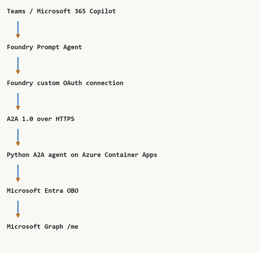
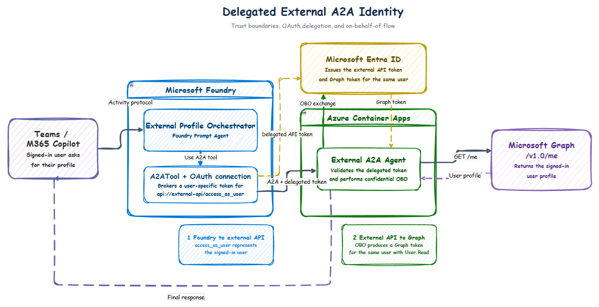

# 🌐 Foundry Prompt Agent calling an external A2A agent with delegated OBO

## End-to-end delegated cross-platform agent sample

This sample implements an attended, delegated multi-agent flow across Teams/Microsoft 365 Copilot, Microsoft Foundry, an external Python A2A agent hosted on
Azure Container Apps (ACA), Microsoft Entra ID, and Microsoft Graph.

💡 **Use case**

A signed-in user asks a Foundry Prompt Agent to identify them. The Foundry agent
delegates that task to an external A2A 1.0 agent using a user-specific OAuth
connection. The external agent validates the delegated token, performs an
OAuth 2.0 on-behalf-of (OBO) exchange, calls Microsoft Graph `/me`, and returns
the signed-in user's profile through A2A.

The end-to-end sequence is:

1. **💬 Receive the request:** the user asks the Foundry caller in Teams,
   Microsoft 365 Copilot, or the Foundry Playground to verify their identity.
2. **🧭 Select the remote agent:** the Foundry Prompt Agent invokes its `A2ATool`.
3. **🎫 Obtain delegated access:** Foundry's custom OAuth connection obtains a
   token for `api://<external-api-client-id>/access_as_user`.
4. **🤝 Delegate over A2A:** Foundry sends an A2A 1.0 JSON-RPC request to the
   external agent on Azure Container Apps.
5. **✅ Validate the caller:** the external agent validates the token signature,
   issuer, tenant, audience, expiry, and delegated scope.
6. **🔐 Exchange the token:** the external agent performs OBO for
   `https://graph.microsoft.com/.default`.
7. **👤 Read the profile:** Microsoft Graph `/me` returns the signed-in user's
   profile.
8. **📝 Return the result:** the external agent returns an A2A artifact, which
   the Foundry caller summarizes for the user.

The Foundry Prompt Agent doesn't receive the user's raw bearer token. Foundry
brokers the token for the external A2A tool, and the external confidential
client performs the downstream OBO exchange.



## Repository contents

📦 **What is included**

| Path | Purpose |
| --- | --- |
| `azure.yaml` | Foundry project and `gpt-5.4-mini` deployment |
| `src/external-agent/` | Python A2A 1.0 server, Entra validation, OBO, and Graph client |
| `src/external-agent/.env.example` | External-agent runtime settings |
| `.env.example` | End-to-end deployment and generated-value checklist |
| `scripts/deploy.ps1` | Complete deployment orchestrator |
| `scripts/create-entra-apps.ps1` | Creates the external API and Foundry OAuth client applications |
| `scripts/deploy-external-agent.ps1` | Builds and deploys the ACA-hosted A2A agent |
| `scripts/deploy-foundry.ps1` | Provisions the Foundry project and model |
| `scripts/create-foundry-connection.ps1` | Creates the custom OAuth credential connection |
| `scripts/create-caller-agent.py` | Creates the Foundry Prompt Agent with `A2ATool` |
| `scripts/smoke-test-external.ps1` | Direct delegated A2A → OBO → Graph test |
| `scripts/invoke-caller.ps1` | Invokes the Foundry caller and surfaces OAuth consent links |
| `scripts/grant-caller-access.ps1` | Grants **Foundry Agent Consumer** to a user or group |

## Architecture and delegated identity

🏗️ **Trust boundaries**



Identity crosses two authorization boundaries:

1. **Foundry → external A2A API**
   - Foundry uses the dedicated OAuth client application.
   - The user authorizes:

     ```text
     api://<external-api-client-id>/access_as_user
     ```

   - The external agent validates the delegated token before accepting the A2A
     request.

2. **External A2A API → Microsoft Graph**
   - The external API uses the incoming token as the OBO assertion.
   - Microsoft Entra issues a Graph token representing the same user.
   - The token includes delegated `User.Read`.

The two Entra applications have separate responsibilities:

| Application | Responsibility |
| --- | --- |
| External A2A Graph Profile API | Resource API, `access_as_user` scope, confidential OBO client |
| Foundry External A2A OAuth Client | Foundry's authorization-code client for the external API |

## Protocols used

🔌 **Each hop uses a different contract**

| Hop | Protocol |
| --- | --- |
| Teams/M365 → Foundry caller | Microsoft 365/Bot Service **Activity protocol** |
| Foundry platform → Prompt Agent | Foundry Responses runtime |
| Foundry caller → external ACA agent | **A2A JSON-RPC 1.0** over HTTPS |
| Foundry OAuth connection → external API | OAuth 2.0 Authorization Code with delegated `access_as_user` |
| External ACA agent → Microsoft Entra | OAuth 2.0 **On-Behalf-Of** token exchange |
| External ACA agent → Microsoft Graph | Microsoft Graph REST over HTTPS |
| External agent → Foundry caller | A2A task/artifact response |
| Foundry → Teams/M365 | Activity protocol response |

The external agent publishes an A2A 1.0 agent card and accepts authenticated
JSON-RPC requests at its ACA root URL. `streaming=False` is used for the external
client and advertised by the agent card.

Azure Container Apps only hosts the external process; it doesn't introduce a
separate application protocol.

## Current prerequisites and limitations

⚠️ **Read this section before provisioning**

- Foundry documentation describes **text-only input/output and no streaming**
  for Foundry-hosted A2A targets. Use `streaming=False` for the safest external
  demo. This repository advertises `AgentCapabilities(streaming=False)` and the
  smoke-test client also disables streaming.
- A2A protocol **1.0 is generally available**. The earlier
  `a2a_preview`/A2A 0.3 surface remains preview. This sample uses
  `A2AProtocolVersion.V1_0` and `a2a-sdk==1.0.3`.
- OAuth-passthrough users need **Foundry Agent Consumer** or **Foundry User** on
  the calling Foundry agent or project. OAuth consent doesn't replace Foundry
  RBAC.
- The first Foundry invocation produces a consent link for the external A2A
  OAuth connection. Complete consent and invoke the request again.
- Teams/M365 uses the Foundry **Activity protocol**. The current Foundry portal
  publish flow enables Activity automatically and selects `BotServiceRbac` or
  `BotServiceTenant` based on the chosen publication scope.
- All participating identities and both Entra applications are expected to use
  the same tenant. Cross-tenant OBO isn't implemented by this demo.
- The external API is public on the internet and protects its JSON-RPC POST
  endpoint with Microsoft Entra OAuth. The health endpoint and agent card remain
  discoverable.
- The external agent uses an in-memory A2A task store and one ACA replica. Use a
  durable shared task store before enabling horizontal scale.
- The Sweden Central resource provider currently returns HTTP 500 when custom
  OAuth is created with connection category `RemoteA2A`. The sample uses an
  OAuth `RemoteTool` connection as the credential store and supplies
  `A2ATool.base_url` explicitly. The wire protocol remains A2A 1.0.
- The automation creates one-year client secrets for demonstration purposes.
  Production deployments should use stronger credential and rotation patterns
  where supported.
- Microsoft Graph access is intentionally limited to delegated `User.Read`.
- The Foundry model deployment uses `gpt-5.4-mini` Global Standard capacity.
  Availability, quota, and permitted deployment types vary by subscription and
  region.
- Teams/M365 publication and OAuth consent can take several minutes to
  propagate. If a channel doesn't render the first consent link correctly,
  establish consent in the Foundry Playground and retry in a new conversation.

## Required tools and permissions

🧰 **Developer tooling and administrative access**

- Windows PowerShell 7.
- Python 3.12 or newer.
- Azure CLI with the Container Apps extension.
- Azure Developer CLI 1.27.1 or newer.
- Microsoft Foundry azd extension:

 ```text
  azd ext install microsoft.foundry
  ```

- Permission to create:
  - Entra app registrations, service principals, scopes, and credentials
  - Azure Container Apps, Container Registry, and resource groups
  - Foundry projects, model deployments, connections, and Prompt Agents
  - Azure role assignments for intended users
- An Entra administrator for tenant-wide delegated consent, or use
  `-SkipAdminConsent` for a single-user deployment.
- Foundry Project Manager or equivalent deployment access.
- Foundry Agent Consumer or Foundry User for every caller.
- Permission to publish the Foundry caller to Teams/Microsoft 365 Copilot.

## Environment templates

⚙️ **Configuration checklist**

The repository contains two safe templates:

| File | Used by |
| --- | --- |
| `.env.example` | End-to-end deployment inputs, outputs, and azd value reference |
| `src/external-agent/.env.example` | External A2A agent runtime/local process |

The root template is a reference checklist; `azd` doesn't import it
automatically. The deployment scripts write generated values and secrets to the
ignored `.azure/` environment. The component template can be copied to `.env`
for local execution.

Never commit populated `.env` files or `.azure/` state. Both are excluded by
`.gitignore`.

## Step 1: Sign in and select deployment values

1️⃣ **Outcome:** authenticated Azure and azd sessions.

From this scenario directory:

```text
az login
azd auth login
az account set --subscription "<subscription-id>"
```

Install or update the Foundry extension:

```text
azd ext install microsoft.foundry
```

Choose values or accept the script defaults:

| Parameter | Default |
| --- | --- |
| Subscription | Script-specific demo value; override for your subscription |
| Region | `swedencentral` |
| azd environment | `external-a2a-obo-demo` |
| Resource group | `rg-foundry-external-a2a-agent` |
| Container App | `external-graph-profile-agent` |
| Foundry caller | `external-profile-orchestrator` |

## Step 2: Run the automated deployment

2️⃣ **Outcome:** Entra applications, ACA-hosted A2A agent, Foundry project,
OAuth connection, and Prompt Agent caller.

Run:

```text
.\scripts\deploy.ps1 `
  -SubscriptionId "<subscription-id>" `
  -Location "swedencentral" `
  -EnvironmentName "external-a2a-obo-demo" `
  -ResourceGroup "rg-foundry-external-a2a-agent"
```

The deployment normally takes 10–20 minutes and performs:

1. Azure CLI and azd authentication checks.
2. azd environment creation or selection.
3. Python dependency installation.
4. Unit, Python, and PowerShell validation.
5. External API and Foundry OAuth client creation.
6. Delegated scope, Graph permission, and consent configuration.
7. ACR build and Azure Container Apps deployment.
8. Foundry project and model provisioning.
9. Custom OAuth connection creation and redirect registration.
10. Foundry Prompt Agent creation with A2A 1.0.
11. Direct delegated A2A → OBO → Graph smoke test.

At completion, record:

```text
External A2A endpoint
Foundry project endpoint
Foundry caller agent name
External API client ID
Foundry OAuth client ID
```

### Deploy without tenant-wide admin consent

If the current account can't grant tenant-wide consent:

```text
.\scripts\deploy.ps1 `
  -SubscriptionId "<subscription-id>" `
  -SkipAdminConsent
```

This grants delegated consent only for the deploying user. An administrator can
later grant tenant-wide consent:

```text
$api = azd env get-value EXTERNAL_API_CLIENT_ID
$client = azd env get-value FOUNDRY_OAUTH_CLIENT_ID

az ad app permission admin-consent --id $api
az ad app permission admin-consent --id $client
```

After changing consent, recreate the connection and caller, then retest:

```text
.\scripts\create-foundry-connection.ps1
.\scripts\create-caller-agent.ps1
.\scripts\smoke-test-external.ps1
```

## Step 3: Verify the external A2A agent

3️⃣ **Outcome:** independently verified ACA health, agent card, delegated token,
OBO, and Graph call.

Check the health endpoint:

```text
$externalUrl = azd env get-value EXTERNAL_A2A_BASE_URL
Invoke-RestMethod "$externalUrl/healthz"
```

Expected:

```text
ok
```

Run the direct delegated smoke test:

```text
.\scripts\smoke-test-external.ps1
```

The test:

1. Acquires an `access_as_user` token for the signed-in Azure CLI user.
2. Discovers the external agent card.
3. Uses A2A 1.0 with `streaming=False`.
4. Sends `Who am I?`.
5. Confirms the external agent completes OBO and returns a Graph-backed artifact.

## Step 4: Establish Foundry OAuth consent

4️⃣ **Outcome:** a reusable per-user OAuth grant for the external A2A API.

Open the deployed caller in the Foundry Playground:

```text
external-profile-orchestrator
```

Ask:

```text
Who am I? Verify my delegated identity.
```

The first invocation normally returns a consent item:

1. Open the consent link.
2. Sign in as the intended user.
3. Complete authorization.
4. Ask the same question again.

You can perform the same flow from PowerShell:

```text
.\scripts\invoke-caller.ps1
```

Open the returned `consent_link`, then invoke again:

```text
.\scripts\invoke-caller.ps1
```

The second invocation should return the profile of the user who completed
consent—not the deployer's profile.

## Step 5: Publish the Foundry caller to Teams and Microsoft 365

5️⃣ **Outcome:** users can invoke the complete flow from Microsoft 365 clients.

1. Open the Foundry project and `external-profile-orchestrator`.
2. Confirm the active version works in the Playground.
3. Open **Publish → Teams and Microsoft 365 Copilot**.
4. For personal testing, publish for yourself or selected users.
5. For organization discovery, submit the application for the required admin
   approval and publish it through the Microsoft 365 admin center.
6. Ensure the application is allowed in the Teams admin center.
7. Install/open the agent in Teams or Microsoft 365 Copilot.
8. Share the Foundry caller with the same users or security group that receives
   Foundry RBAC.

The Foundry portal publish flow automatically enables the Activity protocol and
configures the authorization scheme for the selected scope:

- **Just you/shared** uses `BotServiceRbac`.
- **People in your organization** uses `BotServiceTenant`.

Manual Activity configuration is needed only for custom/REST publication flows
or private-network scenarios that require `enable_m365_public_endpoint`.

Publication can take several minutes to propagate. Start a new conversation
after publishing a new version or changing consent.

## Step 6: Run the end-to-end Teams/M365 demo

6️⃣ **Outcome:** Teams/M365 → Foundry → external A2A → Graph OBO.

Ask:

```text
Who am I? Verify my delegated identity.
```

Expected behavior:

1. Foundry selects the external A2A tool.
2. If the user hasn't consented, the first request produces a consent link.
3. The user completes OAuth authorization.
4. The user invokes the request again.
5. The external ACA agent validates the user token.
6. OBO obtains a Graph token for the same user.
7. The response contains the Graph `/me` profile and delegation explanation.

If the M365 channel doesn't render the consent item correctly, establish consent
for that user in the Foundry Playground, then retry from a new M365
conversation.

## Step 7: Add another user or security group

7️⃣ **Outcome:** additional callers receive independent RBAC and OAuth grants.

Grant project-level consumer access:

```text
.\scripts\grant-caller-access.ps1 `
  -PrincipalObjectId "<user-or-group-object-id>" `
  -PrincipalType Group
```

The user then:

1. Opens the published Foundry caller.
2. Completes their own OAuth consent.
3. Repeats the request.
4. Receives their own Graph profile.

To demonstrate denial, enable **Assignment required** on the external API
enterprise application and assign only approved users/groups.

## Verify and monitor each hop

🔎 **Collect independent evidence**

### Foundry trace

The caller trace should show:

```text
external-profile-orchestrator
  → A2ATool
  → external A2A task/artifact
  → final response
```

### Azure Container Apps logs

```text
$resourceGroup = azd env get-value EXTERNAL_RESOURCE_GROUP
$containerApp = azd env get-value EXTERNAL_CONTAINER_APP_NAME

az containerapp logs show `
  --resource-group $resourceGroup `
  --name $containerApp `
  --follow
```

Successful logs include accepted delegated requests and completed task IDs. The
agent logs object IDs for correlation, but doesn't log bearer tokens or client
secrets.

### Microsoft Graph

The returned artifact contains:

- Tenant and object identifiers from the incoming token
- Incoming delegated scopes
- Selected `/me` fields such as display name, UPN, mail, job title, and
  department

## Local validation

🧪 **Run before deployment or after code changes**

```text
.\scripts\install-dev.ps1
.\scripts\validate-local.ps1
```

This installs the development dependencies, runs unit tests, compiles Python,
and parses every PowerShell script.

For local external-agent startup:

```text
Copy-Item `
  .\src\external-agent\.env.example `
  .\src\external-agent\.env

& .\.venv\Scripts\uvicorn.exe `
  main:app `
  --app-dir .\src\external-agent `
  --host 0.0.0.0 `
  --port 8000 `
  --env-file .\src\external-agent\.env
```

A local process can validate startup and token handling, but a complete OAuth
authorization-code and OBO flow requires correctly registered public redirect
and resource URLs.

## Troubleshooting

🩺 **Fast symptom-to-cause guide**

| Symptom | Likely cause | Resolution |
| --- | --- | --- |
| No OAuth consent item | Foundry didn't select the A2A tool | Strengthen caller instructions and inspect the Foundry trace |
| First call returns consent only | Expected first-use behavior | Complete consent and invoke the same request again |
| OAuth sign-in fails | Redirect URI, client secret, tenant endpoint, or scope mismatch | Recreate the connection and verify the registered redirect URI |
| External endpoint returns `401` | Wrong audience/tenant or missing `access_as_user` | Inspect token claims and Entra app configuration |
| OBO fails | Graph `User.Read` consent missing or external API secret is stale | Grant consent and synchronize the Container App secret |
| Agent card loads but A2A task fails | Authentication applies to POST requests or the ACA process failed | Inspect Container App logs and health |
| Second user receives `403` from Foundry | Missing Foundry Agent Consumer/User | Run `grant-caller-access.ps1` for the user/group |
| Teams/M365 publication doesn't enable Activity | Portal publication didn't complete or a custom/REST path was used | Retry portal publication, or configure Activity explicitly for the custom publication path |
| Teams/M365 doesn't show consent | Channel didn't render the OAuth item | Establish consent in Foundry Playground and retry |
| A2A streaming fails | Current target path is designed for nonstreaming text | Keep `streaming=False` |
| `RemoteA2A` connection creation returns HTTP 500 | Regional resource-provider compatibility issue | Use the included `RemoteTool` OAuth credential fallback |
| No Graph profile for another user | Consent or enterprise-app assignment is missing | Authorize and assign that user, then retry |

## Secret rotation

🔄 **Rotate both confidential applications carefully**

The deployment uses:

- External API secret in ACA secret `api-client-secret`
- Foundry OAuth client secret in the Foundry connection

When rotating:

1. Create the new Entra credential.
2. Update the ACA secret for the external API.
3. Update the ignored azd environment values.
4. Recreate the Foundry OAuth connection with the new client secret.
5. Register the newly generated redirect URI.
6. Recreate or update the caller if the connection identity changed.
7. Reauthorize affected users when requested.
8. Delete the old credential only after end-to-end verification.

The automation's `create-entra-apps.ps1` rotates the demo credentials when
rerun. Plan for that behavior before using it against a shared environment.

## Production recommendations

🛡️ **Move from demonstration to production readiness**

- Replace client secrets with certificates or federated credentials where the
  target platform supports them.
- Replace the in-memory task store before using multiple replicas.
- Put API Management or a WAF in front of the public external endpoint.
- Add rate limiting, request-size limits, replay protection, and explicit
  timeout/retry policies.
- Propagate Conditional Access claims challenges instead of returning a generic
  OBO failure.
- Add distributed trace correlation across M365, Foundry, A2A, ACA, Entra, and
  Graph.
- Define consent-revocation, offboarding, role-review, and secret-rotation
  procedures.
- Minimize Graph permissions and review delegated grants regularly.
- Add prompt-injection defenses, content-safety evaluation, and protocol
  conformance testing.

## References

📚 **Primary product and protocol documentation**

- [A2A protocol specification](https://a2a-protocol.org/latest/specification/)
- [Connect Foundry to an A2A agent](https://learn.microsoft.com/azure/foundry/agents/how-to/tools/agent-to-agent)
- [Foundry A2A authentication](https://learn.microsoft.com/azure/foundry/agents/concepts/agent-to-agent-authentication)
- [Configure and share a Foundry agent](https://learn.microsoft.com/azure/foundry/agents/how-to/configure-agent)
- [Publish Foundry agents to Teams/M365](https://learn.microsoft.com/azure/foundry/agents/how-to/publish-copilot)
- [OAuth 2.0 OBO flow](https://learn.microsoft.com/entra/identity-platform/v2-oauth2-on-behalf-of-flow)
- [Microsoft Graph `/me`](https://learn.microsoft.com/graph/api/user-get)
