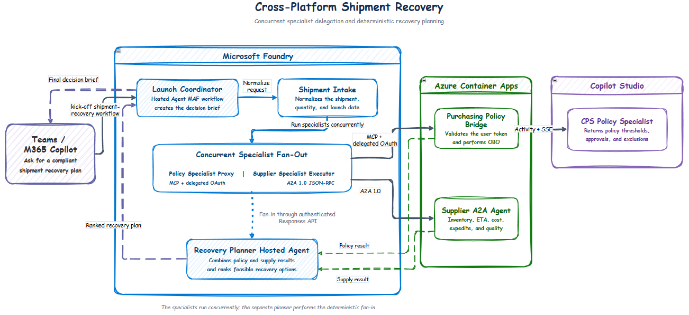

# 🚚 Cross-Platform Delayed-Shipment Recovery

This sample implements an attended shipment-recovery workflow across Teams or
Microsoft 365 Copilot, two Microsoft Foundry Hosted Agents, a Copilot Studio
(CPS) policy specialist, and an external A2A supplier agent on Azure Container Apps
(ACA).

## 🧭 Navigation

- [Use case](#-use-case)
- [Agent roles at a glance](#-agent-roles-at-a-glance)
- [Architecture and flow](#-architecture-and-flow)
- [Protocols](#-protocols-used)
- [Identity and authorization](#-identity-and-authorization)
- [Prerequisites and limitations](#-current-prerequisites-and-limitations)
- [Deployment](#step-1-create-and-publish-the-cps-policy-specialist)
- [Verification](#-verify-and-troubleshoot-each-hop)
- [Production recommendations](#-production-recommendations)

## 💡 Use case

A product launch depends on a component shipment that is late. The user asks the
Launch Coordinator to determine whether the launch can proceed and to recommend
the lowest-cost recovery plan that satisfies purchasing policy.

```text
Shipment SHP-10042 is delayed. Can we still launch UrbanGlide on October 7?
Recommend the lowest-cost compliant recovery plan.
```

The end-to-end sequence is:

1. **💬 Receive the request:** the user contacts the published coordinator from
   Teams or Microsoft 365 Copilot.
2. **📦 Normalize the disruption:** shipment intake loads the synthetic shipment,
   launch date, required quantity, and incumbent-supplier status.
3. **⚡ Run specialists concurrently:** the orchestrator calls the Purchasing
   Policy Specialist and Supplier Specialist at the same time.
4. **📜 Evaluate policy:** the policy specialist returns sourcing thresholds,
   approval requirements, and disallowed conditions from its synthetic policy.
5. **🏭 Check supply:** the supplier specialist returns synthetic inventory,
   delivery dates, unit prices, expedite fees, and quality status over A2A.
6. **🧮 Build the recovery plan:** the orchestrator fans both results into the
   separate Recovery Planner Hosted Agent, which deterministically calculates
   and ranks feasible options.
7. **📝 Present the decision:** the Launch Coordinator summarizes the recommended
   option, cost, compliance status, approvals, rejected alternatives, and next
   actions.

### Expected demo outcome

For `SHP-10042`, the workflow recommends:

```text
Split incumbent + Alpine Energy
1,000 units available by launch
October 6 delivery
USD 7,800 incremental cost
Policy compliant
```

All shipment, inventory, supplier, and purchasing-policy data in this repository
is synthetic.

## 🤖 Agent roles at a glance

| Agent or component | Implementation | Responsibility |
| --- | --- | --- |
| **Launch Coordinator** | Model-backed Agent Framework participant inside `shipment-recovery-orchestrator` | Produces the final decision brief without changing calculated values |
| **Shipment Intake** | Deterministic executor inside the orchestrator | Resolves and normalizes shipment and launch requirements |
| **Purchasing Policy Specialist** | Standard-harness CPS agent called through an OAuth-protected MCP/OBO bridge on ACA | Evaluates synthetic purchasing policy and returns structured constraints |
| **Supplier Specialist** | Standalone Python A2A 1.0 agent on ACA | Returns synthetic supply, ETA, cost, expedite fee, and quality data |
| **Recovery Planner** | Separate Foundry Hosted Agent, `shipment-recovery-planner` | Deterministically combines the two specialist results and ranks feasible recovery options |
| **Foundry orchestrator** | Agent Framework workflow hosted as `shipment-recovery-orchestrator` | Owns intake, concurrent fan-out, fan-in to the remote planner, and final coordination |

The Recovery Planner is deliberately a **separate Hosted Agent**. It has its own
deployment, managed identity, Responses endpoint, logs, and lifecycle. The
orchestrator identity receives least-privilege **Foundry Agent Consumer** access
to that planner.

## 🏗️ Architecture and flow



The orchestrator workflow is:

```text
ShipmentIntake
  → ConcurrentBuilder(
      Purchasing Policy Specialist,
      Supplier Specialist
    )
  → RemoteRecoveryPlanner
  → LaunchCoordinator
```

`WorkflowBuilder(...).build().as_agent()` exposes the complete coordinator
workflow through the Foundry Responses hosting adapter.

## 📦 Repository contents

| Path | Purpose |
| --- | --- |
| `azure.yaml` | Foundry project, model, OAuth connection, toolbox, orchestrator, and separate planner Hosted Agent |
| `src/orchestrator/` | Coordinator Hosted Agent and Agent Framework workflow |
| `src/orchestrator/data/shipments.json` | Synthetic delayed-shipment scenario and local mock data |
| `src/recovery-planner/` | Separate deterministic Recovery Planner Hosted Agent |
| `src/policy-bridge/` | MCP bridge, delegated-token validation, OBO, and CPS client |
| `src/supplier-agent/` | External A2A 1.0 server and synthetic inventory |
| `copilot-studio/INSTRUCTIONS.txt` | CPS Purchasing Policy Specialist instructions |
| `copilot-studio/SYNTHETIC-PURCHASING-POLICY.txt` | Synthetic CPS grounding document |
| `scripts/deploy.ps1` | End-to-end deployment orchestrator |
| `scripts/grant-planner-access.ps1` | Grants the orchestrator identity access to the planner |
| `.env.example` | Complete deployment-input, generated-output, and runtime checklist |
| `src/*/.env.example` | Component-specific local runtime templates |

## 🔌 Protocols used

| Hop | Protocol |
| --- | --- |
| Teams/M365 → Foundry publication layer | Microsoft 365/Bot Service **Activity protocol** |
| Foundry platform → orchestrator container | Foundry **Responses protocol 2.0** |
| Orchestrator → policy bridge | **MCP Streamable HTTP** over HTTPS |
| Foundry OAuth connection → policy bridge | OAuth 2.0 Authorization Code with delegated `access_as_user` |
| Policy bridge → Microsoft Entra | OAuth 2.0 **On-Behalf-Of (OBO)** exchange |
| Policy bridge → CPS | CPS authenticated conversation API using Activity messages |
| CPS → policy bridge | **Server-Sent Events (SSE)** carrying Activity JSON |
| Orchestrator → supplier agent | **A2A JSON-RPC 1.0** over HTTPS |
| Supplier agent → orchestrator | A2A task and artifact response |
| Orchestrator → Recovery Planner Hosted Agent | Authenticated Foundry **Responses API** |
| Foundry publication layer → Teams/M365 | Activity protocol response |

The coordinator and planner declare **only Responses 2.0** in `azure.yaml`.
Do not manually add an Activity protocol declaration to either Hosted Agent.
When the coordinator is published from Foundry to Teams/M365, the Foundry
publication layer creates the supported Activity-to-Responses bridge. Manually
advertising Activity sends raw Bot Framework traffic to `/api/messages`, which
`ResponsesHostServer` does not serve and results in HTTP 404.

## 🔐 Identity and authorization

1. **Teams/M365 → Foundry coordinator**
   - Foundry publication authenticates the channel user.
   - The user needs access to the published app and the RBAC scope selected during
     publication.
2. **Foundry → CPS policy specialist**
   - The managed OAuth connection obtains a user token for:

     ```text
     api://<policy-bridge-client-id>/access_as_user
     ```

   - The bridge validates the delegated token and performs OBO for Power Platform
     `CopilotStudio.Copilots.Invoke`.
   - CPS evaluates policy as the signed-in user.
3. **Orchestrator → Recovery Planner**
   - The orchestrator uses its Hosted Agent managed identity.
   - `scripts/grant-planner-access.ps1` grants that identity **Foundry Agent
     Consumer** on only `shipment-recovery-planner`.

The supplier endpoint is intentionally unauthenticated in this synthetic demo.
Protect it with Entra workload identity, OAuth, or API Management before using
real supplier data.

## ⚠️ Current prerequisites and limitations

### Copilot Studio and publication

> [!IMPORTANT]
> The CPS Purchasing Policy Specialist must use the **Standard harness**. The
> authenticated CPS execution API used here doesn't support GitHub Copilot
> harness agents.

- The CPS agent must be published and shared with intended users before the
  policy bridge invokes it.
- The coordinator and planner use `ResponsesHostServer` and must remain
  Responses-only in `azure.yaml`. Teams/M365 Activity support is added by the
  Foundry publication flow, not by the source declaration.
- After redeploying or replacing the coordinator agent/version, **republish it
  from Foundry to Teams/M365**. Refresh or reinstall the Teams app if Foundry
  produces a new package or version.
- Teams/M365 publication, RBAC, OAuth consent, and app updates can take several
  minutes to propagate. Start a new Teams conversation after republishing.

### Identity, consent, and RBAC

- All Microsoft identities, the CPS environment, the Entra application, and the
  Foundry project are expected to be in one Entra tenant. Cross-tenant OBO is not
  implemented.

> [!NOTE]
> The first policy-tool invocation can return a Foundry OAuth consent link.
> Complete consent and submit the original request again.

- OAuth-backed callers need **Foundry Agent Consumer** or higher on the
  coordinator or its parent project. OAuth consent does not replace Foundry RBAC.
- The Recovery Planner is a separate Hosted Agent. The coordinator cannot call it
  until its managed identity receives **Foundry Agent Consumer** on the planner;
  the deployment script applies this assignment.

### External services and runtime constraints

> [!WARNING]
> The supplier A2A endpoint is public, unauthenticated, and contains synthetic
> data only. Protect it before using real supplier information.

- A2A 1.0 is used with `streaming=False`. The supplier uses an in-memory task
  store and one ACA replica.
- The bridge and supplier are deployed from source with `az containerapp up`;
  Azure Container Registry and Container Apps build permissions are required.

### Production boundaries

- One Entra app acts as both bridge resource API and OBO client for demo
  convenience. Separate these responsibilities in production.
- The automation creates a one-year client secret. Use certificates, workload
  identity, or managed secret rotation for production.
- Recovery calculations are deterministic, but CPS policy output and the final
  model-generated narrative must be evaluated before production use.
- The model deployment uses `gpt-5.4-mini` Global Standard capacity. Availability,
  quota, and allowed deployment types vary by subscription and region.
- The sample does not place orders, reserve stock, or commit spend. Those actions
  require an explicit human approval and transactional integration.

## 🧰 Required tools and permissions

- PowerShell 7 or Windows PowerShell.
- Python 3.13 for parity with the Hosted Agent runtime.
- Azure CLI, signed in to the target tenant and subscription.
- Azure Developer CLI 1.27.1 or newer.
- Microsoft Foundry azd extension:

  ```text
  azd ext install microsoft.foundry
  ```

- Permission to create:
  - Entra app registrations, service principals, delegated scopes, and secrets
  - Azure resource groups, Container Apps, and Container Registry builds
  - Foundry projects, model deployments, connections, toolboxes, and Hosted Agents
  - Azure role assignments on the Recovery Planner and intended caller scope
- An Entra administrator for tenant-wide delegated consent, or use
  `-SkipAdminConsent` and complete consent separately.
- Foundry Project Manager or equivalent deployment access.
- Copilot Studio maker permissions and permission to publish/share the policy
  specialist.
- Permission to publish the coordinator to Teams and Microsoft 365 Copilot.

## ⚙️ Environment templates

| File | Used by |
| --- | --- |
| `.env.example` | End-to-end deployment inputs, generated outputs, and azd value reference |
| `src/orchestrator/.env.example` | Coordinator runtime or local execution |
| `src/recovery-planner/.env.example` | Recovery Planner runtime or local execution |
| `src/policy-bridge/.env.example` | Policy bridge runtime or local execution |
| `src/supplier-agent/.env.example` | Supplier A2A runtime or local execution |

The root template is a reference checklist; `azd` does not import it
automatically. `scripts/deploy.ps1` writes inputs, generated IDs, endpoints, and
secrets into the ignored azd environment under `.azure/`. Component templates can
be copied to `.env` for local execution.

Never commit populated `.env` files or `.azure/` state.

## 🧪 Local validation

From this directory:

```text
.\scripts\validate-local.ps1
```

Mock mode uses policy and supplier records from
`src/orchestrator/data/shipments.json`. It validates intake, concurrent fan-out,
fan-in, planner calculations, remote-planner payload handling, policy bridge
behavior, and supplier A2A behavior without deploying Azure resources.

## Step 1: Create and publish the CPS policy specialist

1️⃣ **Outcome:** a published Standard-harness CPS agent that returns structured
policy constraints.

1. Open Copilot Studio in the target Entra tenant.
2. Turn off the new/GitHub Copilot experience or choose the option to create a
   **Standard harness** agent.
3. Name it `Purchasing Policy Specialist`.
4. Apply `copilot-studio/INSTRUCTIONS.txt` as its instructions.
5. Add `copilot-studio/SYNTHETIC-PURCHASING-POLICY.txt` as a knowledge source.
6. Configure **Authenticate with Microsoft**.
7. Publish the agent and share it with intended demo users.
8. Record:
   - the environment ID, for example `Default-<tenant-guid>`
   - the schema name, for example `new_PurchasingPolicySpecialist`

Use the internal schema name, not only the display name.

## Step 2: Sign in and create an azd environment

2️⃣ **Outcome:** authenticated Azure and azd sessions with an isolated deployment
environment.

```text
cd C:\Users\clemm.EUROPE\source\repos\MultiAgentCrossPlatform\shipment-demo

az login
azd auth login
azd ext install microsoft.foundry
azd env new shipment-recovery-demo
```

If the azd environment already exists, select it:

```text
azd env select shipment-recovery-demo
```

## Step 3: Deploy the complete scenario

3️⃣ **Outcome:** ACA specialists, Foundry infrastructure, the coordinator Hosted
Agent, and the separate Recovery Planner Hosted Agent are deployed and connected.

```text
.\scripts\deploy.ps1 `
  -SubscriptionId "<subscription-id>" `
  -Location "swedencentral" `
  -ResourceGroup "rg-shipment-recovery-demo" `
  -CopilotStudioEnvironmentId "Default-<tenant-guid>" `
  -CopilotStudioSchemaName "new_PurchasingPolicySpecialist"
```

Use `-SkipAdminConsent` when a tenant administrator will grant Power Platform
delegated consent separately.

The script:

1. Selects the Azure subscription and writes deployment values to the azd
   environment.
2. Creates or reuses the policy-bridge Entra application, `access_as_user` scope,
   service principal, Power Platform delegated permission, and client secret.
3. Deploys the supplier A2A agent to ACA, first with startup-safe placeholder
   settings and then with its actual public URL.
4. Deploys the policy MCP/OBO bridge to ACA, stores its secret in Container Apps,
   and then applies the actual MCP URL.
5. Runs `azd up` to provision the Foundry project, `gpt-5.4-mini`, OAuth
   connection, MCP toolbox, coordinator Hosted Agent, and separate planner Hosted
   Agent.
6. Grants the coordinator managed identity **Foundry Agent Consumer** on the
   Recovery Planner.
7. Reads the Foundry OAuth connection redirect URI and registers it on the Entra
   application.

The deployment intentionally leaves both Hosted Agents configured only for
Responses 2.0. Do not add Activity to `azure.yaml`.

## Step 4: Establish OAuth consent and test in Foundry

4️⃣ **Outcome:** the complete workflow succeeds in the Foundry Playground before
channel publication.

1. Open `shipment-recovery-orchestrator` in the Foundry Playground.
2. Submit:

   ```text
   Analyze delayed shipment SHP-10042 and recommend a recovery plan.
   ```

3. On the first invocation, open the returned OAuth consent link.
4. Complete authorization for the policy bridge.
5. Submit the same request again.
6. Confirm that the response reports 1,000 units by October 6, USD 7,800
   incremental cost, and policy compliance.

## Step 5: Publish the coordinator to Teams and Microsoft 365

5️⃣ **Outcome:** users can invoke the coordinator from Teams/M365 through
Foundry's Activity-to-Responses bridge.

1. In Foundry, open `shipment-recovery-orchestrator`.
2. Select **Publish → Teams and Microsoft 365 Copilot**.
3. Choose the intended scope; publish for yourself first.
4. Complete any requested Azure Bot Service and RBAC configuration.
5. Ensure intended callers have **Foundry Agent Consumer** on the coordinator or
   the parent project when using an RBAC-scoped publication.
6. Install the generated app in Teams or Microsoft 365 Copilot.
7. Start a **new conversation** and submit the shipment prompt.

Foundry publication enables Activity and bridges it to the coordinator's
Responses endpoint. A manually declared Activity protocol is neither required nor
supported by this `ResponsesHostServer` implementation.

### Redeployment and republishing

After source changes:

```text
.\scripts\deploy.ps1 `
  -SubscriptionId "<subscription-id>" `
  -Location "swedencentral" `
  -ResourceGroup "rg-shipment-recovery-demo" `
  -CopilotStudioEnvironmentId "Default-<tenant-guid>" `
  -CopilotStudioSchemaName "new_PurchasingPolicySpecialist"
```

Then republish `shipment-recovery-orchestrator` from Foundry to Teams/M365. If
Foundry creates a new app package or version, refresh or reinstall it and start a
new conversation.

## 🔎 Verify and troubleshoot each hop

### Foundry coordinator and planner

- The coordinator trace should contain both parallel specialist branches.
- The planner call should target:

  ```text
  .../agents/shipment-recovery-planner/endpoint/protocols/openai/responses
  ```

- A planner `403` normally means the coordinator identity is missing **Foundry
  Agent Consumer** on the planner. Rerun:

  ```text
  .\scripts\grant-planner-access.ps1
  ```

### Policy bridge

```text
$resourceGroup = azd env get-value AZURE_RESOURCE_GROUP
$bridge = azd env get-value POLICY_BRIDGE_CONTAINER_APP_NAME

az containerapp logs show `
  --resource-group $resourceGroup `
  --name $bridge `
  --follow
```

Successful logs include the MCP request, shipment ID, CPS conversation, and
duration. A consent response is expected on the first user invocation.

### Supplier A2A agent

```text
$supplier = azd env get-value SUPPLIER_CONTAINER_APP_NAME

az containerapp logs show `
  --resource-group $resourceGroup `
  --name $supplier `
  --follow
```

The supplier must publish its A2A agent card and return a task artifact. The
orchestrator reads structured artifact parts directly; it does not parse the
protobuf object's string representation.

### Teams/M365

- If Foundry works but Teams returns or logs `POST /api/messages` with HTTP 404,
  verify that `azure.yaml` declares **only** `responses`, redeploy, and republish
  from Foundry.
- Do not add `protocol: activity` to work around the 404.
- If Teams still uses the old publication, reinstall the latest app package and
  start a new conversation.
- Establish OAuth consent in the Foundry Playground if the channel does not render
  the first consent link reliably.

## 🛡️ Production recommendations

- Protect the supplier endpoint with Entra workload identity, OAuth, or API
  Management.
- Use durable A2A task storage and multi-replica-safe state.
- Split OAuth client and bridge resource API registrations.
- Replace client secrets with certificates, federated credentials, or managed
  identity where supported.
- Add human approval before placing orders, reserving stock, or committing
  expedite spend.
- Add idempotency, timeout, retry, circuit-breaker, and compensation behavior.
- Correlate Teams, Foundry, workflow, Responses, MCP, CPS, A2A, and transaction
  identifiers.
- Validate all structured specialist outputs before planning.
- Add evaluation datasets for policy compliance, option ranking, grounded final
  recommendations, and adversarial inputs.

## 📚 References

- [Agent Framework orchestrations](https://learn.microsoft.com/agent-framework/workflows/orchestrations/)
- [Concurrent orchestration](https://learn.microsoft.com/agent-framework/workflows/orchestrations/concurrent)
- [Foundry Hosted Agents](https://learn.microsoft.com/azure/foundry/agents/concepts/hosted-agents)
- [Foundry Toolboxes](https://learn.microsoft.com/azure/foundry/agents/how-to/tools/toolbox)
- [A2A protocol specification](https://a2a-protocol.org/latest/specification/)
- [OAuth 2.0 OBO](https://learn.microsoft.com/entra/identity-platform/v2-oauth2-on-behalf-of-flow)
